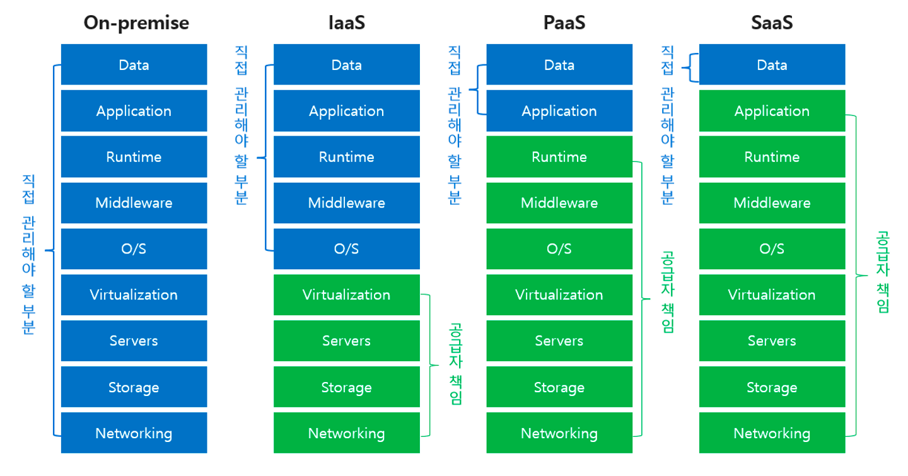
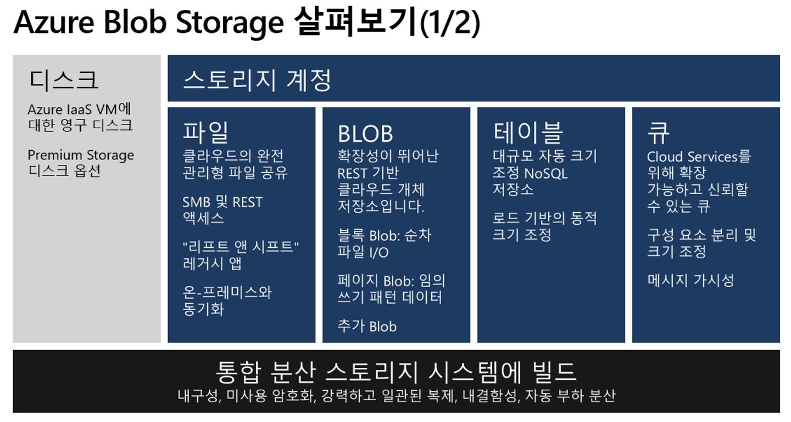
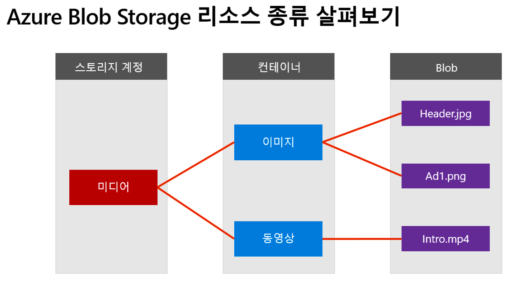
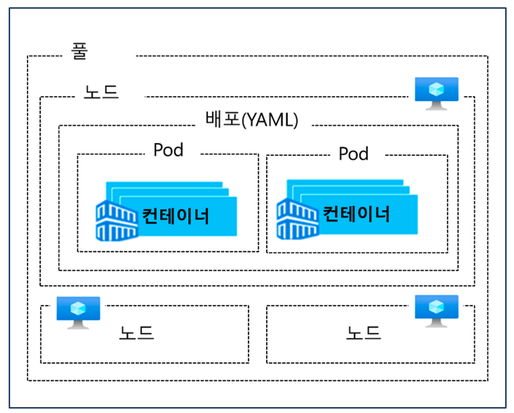

# Azure를 이해하기 위한 #1

 

## 🎁 1-1. Azure의 가벼운 개념들

- Azure는 전 세계 60개 이상의 리전을 운영
    - 한국은 `중부, 남부` 리전을 운영

 

- Azure Datacenter 리전 간의 연결은 인터넷을 거치지 않고 고성능의 MS NW를 통해 연결

 

### Cloud Service Type

 

## Paas, [Platform as a Service]

PaaS는 사용자에게 소프트웨어 개발 및 배포를 위한 플랫폼을 제공하는 클라우드 서비스 모델.  

예를 들어, Heroku는 PaaS를 제공하는 플랫폼 중 하나입니다. 개발자는 Heroku를 통해 자신들의 웹 애플리케이션을 쉽게 배포하고 관리할 수 있다.  
Heroku는 개발 도구, 데이터베이스, 서버 등 개발에 필요한 모든 요소를 제공.  

* Heroku
* Microsoft Azure
* AWS Elastic Beanstalk

## Saas, [Software as a Service]

SaaS는 사용자에게 인터넷을 통해 소프트웨어를 제공하는 클라우드 서비스 모델.  

사용자는 웹 브라우저를 통해 애플리케이션에 접근하며, 서비스 제공자가 애플리케이션의 실행 및 유지 관리를 담당.  

예를 들어, Google Docs는 SaaS의 일종. 사용자는 웹 브라우저를 통해 Google Docs에 접속하고 문서를 작성하거나 편집할 수 있다.  
사용자는 소프트웨어의 설치, 업데이트, 보안 등에 대해 걱정할 필요가 없다.  

## Iaas, [Infrastructure as a Service]

IaaS는 사용자에게 가상화된 컴퓨팅 리소스를 제공하는 클라우드 서비스 모델.  
사용자는 물리적 서버, 네트워크, 데이터 스토리지 등의 IT 인프라를 필요에 따라 확장하거나 축소할 수 있으며,
서비스 제공자가 이러한 인프라의 유지 관리를 담당.  

예를 들어, Amazon Web Services(AWS)는 가장 대표적인 IaaS 제공자 중 하나.  
사용자는 AWS를 통해 서버, 스토리지, 네트워크 등의 인프라를 클라우드 환경에서 이용하고, 필요에 따라 이를 확장하거나 축소할 수 있다.  
AWS는 이러한 인프라의 유지 관리를 담당.  

 

- **Azure의 AutoScale**
    - 애플리케이션 또는 서비스의 **수요에 따라 자동으로 리소스를 확장하거나 축소하는 기능**을 제공하는 서비스.  
      AutoScale을 사용하면 사용자가 정의한 조건에 따라 자동으로 가상 머신(VM) 인스턴스의 수를 조정할 수 있다.

  

- ## 🎁 1-2. Azure Web 운영 서비스

- Azure는 고객이 클라우드 환경에서 DNS(Domain Name System) 서비스를 구축하고 관리할 수 있는 Public DNS와 Private DNS를 모두 제공.

 

### Public DNS

Azure Public DNS는 인터넷에서 도메인 이름을 IP 주소로 해석해 주는 서비스.

이를 통해 사용자는 도메인 이름을 사용하여 애플리케이션, 웹사이트 또는 다른 인터넷 리소스에 액세스할 수 있다.

 

### Private DNS

Azure Private DNS는 가상 네트워크(Virtual Network) 내에서 사용되는 도메인 이름 해석 서비스.

가상 네트워크 내의 리소스 간에 도메인 이름을 사용하여 통신할 수 있도록 지원.

 

### Azure Traffic Manager

Azure의 로드 밸런싱 서비스 중 하나로, 사용자 요청을 여러 엔드 포인트로 분산시켜 가용성과 성능을 향상시키는 기능을 제공.

Traffic Manager는 사용자 요청을 받아 가장 적합한 엔드 포인트로 트래픽을 전달하는 역할을 수행

 

### Azure CDN (Content Delivery Network)

Azure의 전 세계 네트워크로 구성된 분산 콘텐츠 전송 서비스.

Azure CDN은 정적 및 동적 콘텐츠를 고속으로 전달하고, 대역폭을 관리

  

## 🎁 1-3. L4 Load Balancer & L7 Application Gateway

### 요약

- L4 Load Balancer는 네트워크 수준에서 효율적인 로드 밸런싱을 위해 사용
- L7 Application Gateway는 웹 애플리케이션의 고급 로드 밸런싱 및 보안 기능을 제공

 

### L4 Load Balancer

Azure L4 Load Balancer는 **네트워크 계층(Layer 4)에서 동작**하는 로드 밸런서.

IP 주소와 포트 번호에 기반하여 트래픽을 여러 가상 머신 또는 가용한 리소스로 분산.

L4 로드 밸런서는 **TCP와 UDP 트래픽을 로드 밸런싱**하며, 대규모 네트워크 애플리케이션 및 가상 머신 집합에 적합.

 

### L7 Application Gateway

Azure L7 Application Gateway는 **응용 프로그램 계층(Layer 7)에서 동작**하는 로드 밸런서.

HTTP 및 HTTPS 트래픽을 로드 밸런싱 하며, 고급 기능을 제공하여 웹 애플리케이션의 가용성, 확장성 및 보안을 개선.

L7 Application Gateway는 HTTP 요청 기반의 로드 밸런싱, 세션 어피니티, SSL 종단 감지, 웹 애플리케이션 방화벽(WAF) 등을 지원.

  

## 🎁 1-4. 1장 요약

- Azure는 IaaS뿐만 아니라 Paas 기반으로도 사용 가능한 웹 서비스들이 준비
- App Services와 같이 Paas 기반으로 서비스 구현 시, 관리 부담 상당 부분 감소
- 웹 개발 시, DNS, CDN, Traffic Manager, 부하 분산 장치, 스토리지 계정 등 다양한 서비스를 함께 사용

 

---

## 🎁 2-1. Azure Storage Account의 소개와 활용

 

## 🎁 2-2. Azure Blob Storage

대용량의 비정형 데이터를 저장하고 액세스하는 데 사용되는 스토리지 서비스.

Blob Storage는 이미지, 비디오, 문서, 로그 파일 등과 같은 다양한 유형의 데이터를 저장할 수 있다.

- AWS의 S3와 유사하다.

 

### Azure Blob Storage의 주요 특징

1. 비정형 데이터 저장
2. 확장성과 가용성
3. 데이터 보존 및 복구
4. 접근 제어 및 보안
5. 데이터 분석과 통합

  

 

  

## 🎁 2-3. Azure Blob Storage 수명 주기 정책

데이터의 수명 주기에 따라 저장 계층을 자동으로 관리하는 기능.

 

**수명 주기 정책 - 주요 기능**

- 저장 계층 관리
    - 수명 주기 정책은 데이터의 수명 주기에 따라 저장 계층을 자동으로 관리.  
      예를 들어, 데이터가 오래되면 자동으로 차가운(Cool) 또는 아카이브(Archive) 저장 계층으로 이동.

 

- 자동 전환
    - 수명 주기 정책은 정의된 조건에 따라 데이터를 자동으로 다른 저장 계층으로 전환.  
      예를 들어, 특정 기간 동안 액세스 되지 않은 데이터는 자동으로 차가운(Cool) 저장 계층으로 이동할 수 있다.  
      반대로, 다시 액세스 되면 자동으로 더 빠른 저장 계층으로 이동할 수도 있다.

 

- 유연한 구성
    - 수명 주기 정책은 사용자가 정의한 조건을 기반으로 데이터의 이동 및 저장 계층 전환을 구성.

  

## 🎁 2-4. Azure Cosmos DB

NoSQL 데이터베이스 서비스

 

---

## 🎁 4-1. Docker와 Container

 

## 🎁 4-2. Container VS Virtual Machines

 

### Virtual Machine (VM)

- VM은 하이퍼바이저를 사용하여 물리적인 서버 위에 가상의 컴퓨팅 환경 구성.
- VM은 완전히 독립적인 운영 체제(OS)와 애플리케이션을 실행할 수 있다.
- VM은 더 큰 애플리케이션 또는 복잡한 운영 체제 환경을 호스팅 하기에 적합.
  또한, 다양한 운영 체제를 동시에 실행할 수 있는 유연성 제공.

 

### Container:

- 컨테이너는 애플리케이션을 실행하기 위한 격리된 실행 환경을 제공.
- 컨테이너는 가볍고 빠르며, 호스트 운영 체제를 공유하여 자원을 효율적으로 사용.
- 컨테이너는 확장성과 탄력성을 갖추어 빠른 배포 및 확장이 가능하며, 마이크로 서비스 아키텍처 및 DevOps 환경에 적합.

  

## 🎁 4-3. Docker Registry

Docker Hub는 공개 Docker Registry의 예시로, 대규모 커뮤니티에서 Docker 이미지를 공유하는 데 사용.  
또한, 개인이나 조직은 Docker Registry를 자체적으로 구축하여 사설 이미지 저장소를 유지할 수 있다.

 

### Docker Registry의 주요 특징

- 이미지 저장소
- 이미지 관리
- 액세스 제어
- 분산 및 복제
- 공개 및 사설

  

## 🎁 4-4. Azure Container Registry

Docker 이미지를 저장하고 관리하는 서비스, Azure에서 호스팅 되며 컨테이너 기반 애플리케이션의 배포 및 관리를 지원

 

### 🎁 4-5. Kubernetes의 이해와 활용

 

| 용어       | 설명                                        |
|----------|-------------------------------------------|
| 풀        | 동일한 구성을 가진 노드 그룹                          |
| 노드       | 컨테이너화된 애플리케이션을 실행하는 개별 VM                 |
| Pod      | 애플리케이션의 단일 인스턴스, Pod에는 여러 컨테이너가 포함될 수 있다. |
| 배포       | Kubernetes에서 관리되는 하나 이상의 동일한 Pod          |
| file:/// | 배포를 설명하는 YAML 파일                          |

 

### Pod 관리

- Pod 목록 보기: **`kubectl get pods`**
- Pod 자세한 정보 보기: **`kubectl describe pod <pod-name>`**
- Pod 로그 보기: **`kubectl logs <pod-name>`**
- Pod 삭제: **`kubectl delete pod <pod-name>`**

 

### Deployment 관리

- Deployment 목록 보기: **`kubectl get deployments`**
- Deployment 스케일링: **`kubectl scale deployment <deployment-name> --replicas=<replica-count>`**
- Deployment 롤아웃: **`kubectl rollout <command> <deployment-name>`**
- Deployment 업데이트: **`kubectl set image deployment/<deployment-name> <container-name>=<new-image>`**

 

### 서비스 관리

- 서비스 목록 보기: **`kubectl get services`**
- 서비스 정보 보기: **`kubectl describe service <service-name>`**
- 서비스 외부 노출 (LoadBalancer): **`kubectl expose deployment <deployment-name> --type=LoadBalancer --port=<port>`**
- 서비스 내부 노출 (ClusterIP): **`kubectl expose deployment <deployment-name> --port=<port>`**

 

### 네임스페이스(Namespace) 관리

- 네임스페이스 목록 보기: **`kubectl get namespaces`**
- 특정 네임스페이스에 작업 수행: **`kubectl <command> --namespace=<namespace-name>`**

 

### 클러스터 정보 보기

- 클러스터 정보 보기: **`kubectl cluster-info`**
- 노드 목록 보기: **`kubectl get nodes`**
- 노드 자세한 정보 보기: **`kubectl describe node <node-name>`**