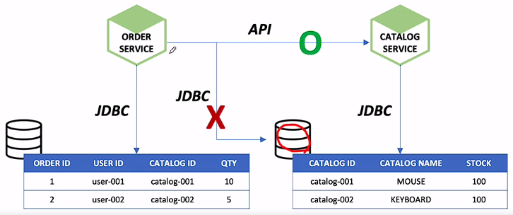

# Event Sourcing + CQRS + Saga Pattern - 찍먹

 

## Event Driven Architecture

* 이벤트 드리븐 아키텍처는 애플리케이션의 구조를 이벤트의 생성과 처리를 중심으로 설계하는 패턴. 

* 하나의 서비스가 이벤트를 발생시키면 다른 서비스가 이를 감지하고 반응하는 방식으로 동작. 

* 서비스 간의 느슨한 결합을 통해 확장성, 유연성을 제공하며 비동기 처리를 통한 높은 성능을 가능하게 한다.

 

### 모놀리틱

* 단일 데이터베이스
  * 하나의 데이터베이스를 사용하여 모든 데이터를 관리하며, 
  * 트랜잭션 처리를 위해 ACID(원자성, 일관성, 고립성, 지속성) 원칙을 지키는 것이 중요.

  

### 마이크로 서비스

* MSA는 애플리케이션을 작은, 독립적이며, 재사용 가능한 서비스로 분리하는 설계 패턴
  * 각 서비스는 자체 DB를 가질 수 있으며, 이를 `폴리글랏(polgylot)` 퍼시스턴스라고 하여,
  * 적절한 데이터 저장 기술을 서비스별로 선택할 수 있도록 한다. 
  * 서비스들은 API를 통해 서로 통신하며, 각 서비스가 독립적으로 개발, 배포, 확장될 수 있게 한다.

 

  

### Commit Transaction & Rollback Transaction

 

* `Commit Transaction`은 해당 트랜잭션의 모든 작업이 성공적으로 완료되었음을 데이터베이스에 알리는 것.
  * 이 경우 데이터베이스는 트랜잭션에 포함된 모든 변경 사항을 확정하고 영구적으로 저장.

 
  
* `Rollback Transaction`은 트랜잭션 중 하나라도 실패하면 트랜잭션에 포함된 모든 작업을 원래 상태로 되돌리는 것. 
  * 이는 데이터의 일관성을 유지하고, 실패한 작업이 데이터베이스에 잘못된 상태를 남기는 것을 방지.

  

   

## Event Sourcing

* 이벤트 소싱은 데이터의 마지막 상태를 저장하는 것이 아니라, 데이터에 발생한 모든 변화를 순차적인 이벤트로 기록하는 방법. 

* 데이터 구조가 단순해지고, 시스템의 상태를 어떤 시점으로도 되돌릴 수 있어 데이터의 일관성과 트랜잭션 처리를 보장할 수 있다. 

* 또한, 이벤트는 애플리케이션의 상태를 직접 변경하지 않고 이벤트 스트림에 추가되므로, 동시에 여러 요청이 발생해도 데이터 충돌이 발생하지 않는다. 

* 그러나 전체 이벤트 히스토리를 저장하고 처리해야 하므로, 큰 규모의 시스템에서는 이를 효율적으로 관리하는 것이 중요.

   

## CQRS(Command and Query Responsibility Segregation)

* 애플리케이션의 데이터 읽기와 쓰기 작업을 논리적으로 분리하는 소프트웨어 아키텍처 패턴. 

* 데이터를 변경하는 Command와 데이터를 조회하는 Query의 두 가지 책임을 분리.

* Command는 시스템의 상태를 변경하는 작업을 담당하며, 이는 일반적으로 비즈니스 로직을 수행하고 유효성 검사를 포함.

* Query는 시스템의 상태를 읽어오는 작업을 담당하며, 데이터의 현재 상태를 표시하는 데 사용.

  

  

   

## Saga Pattern

* 분산 트랜잭션을 처리하는 방법 중 하나로, 모든 마이크로 서비스가 각각의 로컬 트랜잭션을 처리하는 방식

* 크게 두 가지 스타일, Choreography와 Orchestration으로 구분.

* `Choreography 스타일`에서는 각 서비스가 다른 서비스의 이벤트를 감지하고 반응하는 방식으로 독립적으로 동작. 

* ✨ `Orchestration 스타일`에서는 특정 서비스(orchestrator)가 트랜잭션의 전체 흐름을 관리하며 다른 서비스들을 조정.

* Saga 패턴의 중요한 특징 중 하나는 연속적인 트랜잭션 중 하나가 실패할 경우, 이미 완료된 트랜잭션을 취소(rollback) 하기 위한 보상 트랜잭션을 구현하는 것. 
  * 데이터의 원자성을 보장하지는 않지만, 일관성을 유지하는 데 도움.

  

  

### Choreography-based saga

1. 주문 서비스에서 주문 요청(Post)을 수신하고 PENDING 상태의 주문 생성
2. 주문 생성 이벤트 전달
3. 고객 서비스의 Event handler가 Credit 예약 시도
4. 결과 이벤트 전달
5. 주문 서비스의 Event handler를 통해 주문 승인 or 거부
