# Kafka Consumer

### [Kafka 공식 문서](https://kafka.apache.org/)

<br>

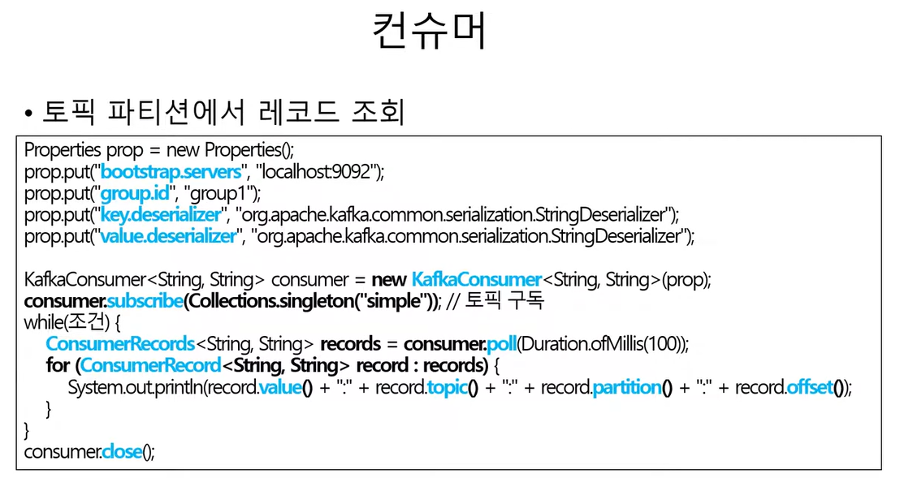

<br>

### Properties 설정

Properties 객체를 생성하여 Kafka 서버와 관련된 설정을 한다.

<br>

### `bootstrap.servers`

Kafka 클러스터에 연결하기 위한 주소다. 

여기서는 "localhost:9092"로 로컬에서 실행 중인 Kafka 서버에 연결한다.

<br>

### `group.id`

Consumer Group의 ID를 설정한다. 

Consumer Group은 여러 Consumer 인스턴스를 묶어 처리량을 확장하거나 메시지를 분배하는 데 사용된다.

<br>

### `key.deserializer와 value.deserializer`

Kafka 메시지는 키와 값의 쌍으로 구성된다. 

이들은 Kafka로부터 메시지를 수신할 때 어떻게 직렬화 해제할지 결정. 

위에서는 문자열로 직렬화 해제하는 StringDeserializer를 사용.

<br><br>

### KafkaConsumer 생성

위에서 정의한 properties를 사용하여 KafkaConsumer 객체를 생성한다.

<br>

### `consumer.subscribe()`

Consumer가 메시지를 수신할 토픽을 구독한다. 위 예제에서는 "simple"이라는 토픽을 구독한다.

<br>

### `메시지 수신`

while 루프 내에서 consumer.poll() 메서드를 사용하여 Kafka로부터 메시지를 수신한다.

poll() 메서드는 지정된 시간 동안 메시지를 대기하며, 여기서는 100밀리초 동안 대기한다.

수신된 각 메시지(레코드)에 대해, 그 내용을 출력한다. 여기서는 메시지의 값, 토픽, 파티션 번호, 오프셋을 출력한다.

<br>

### `consumer.close()`

작업이 끝나면 Consumer를 종료한다.

<br>

이 코드는 Kafka에서 메시지를 수신하는 기본적인 방법을 보여준다.

<br><br><br>

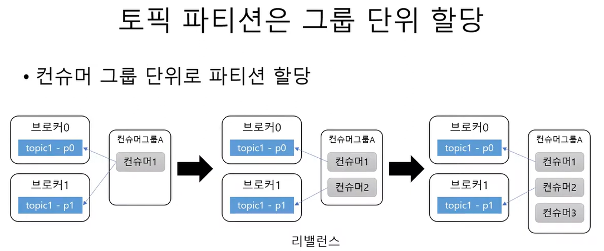

<br>

### 1️⃣

Consumer Group A 내에는 Consumer1 하나만 존재하며, 이 Consumer는 두 개의 파티션 모두에서 메시지를 수신하고 있다.

<br>

### 2️⃣ 

파티션은 이제 두 Consumer 사이에 균등하게 분배된다. Consumer1은 topic1 - p0 파티션에서, Consumer2는 topic1 - p1 파티션에서 메시지를 수신한다.

<br>

### 3️⃣

주의할 점은 현재 토픽 topic1에는 파티션이 2개만 있기 때문에, 한 Consumer는 파티션을 할당받지 못한다. 따라서 Consumer1과 Consumer2는 각각 하나의 파티션에서 메시지를 계속 수신하며, Consumer3는 파티션을 할당받지 못해 메시지를 수신하지 않는다.

<br><br><br>

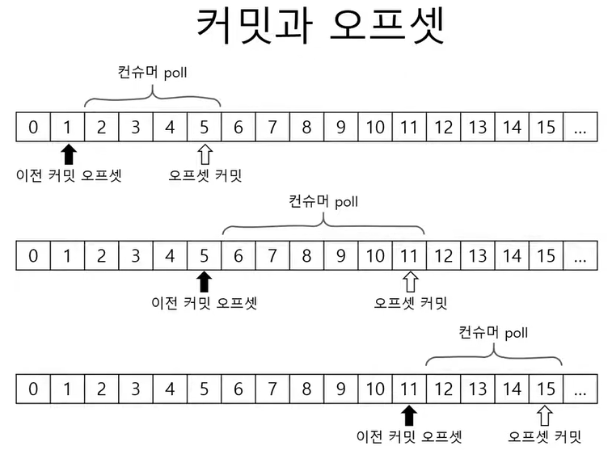

<br>

위 이미지는 카프카 Consumer의 동작 원리 중, 오프셋 관리와 메시지 가져오기의 과정을 간략히 나타내고 있다. 

poll 호출을 통해 메시지를 가져올 때마다, Consumer는 어디까지 메시지를 읽었는지(이전 커밋 오프셋), 그리고 어디까지 메시지를 읽을 수 있는지(오프셋 커밋)를 업데이트하며 동작한다.

<br><br><br>

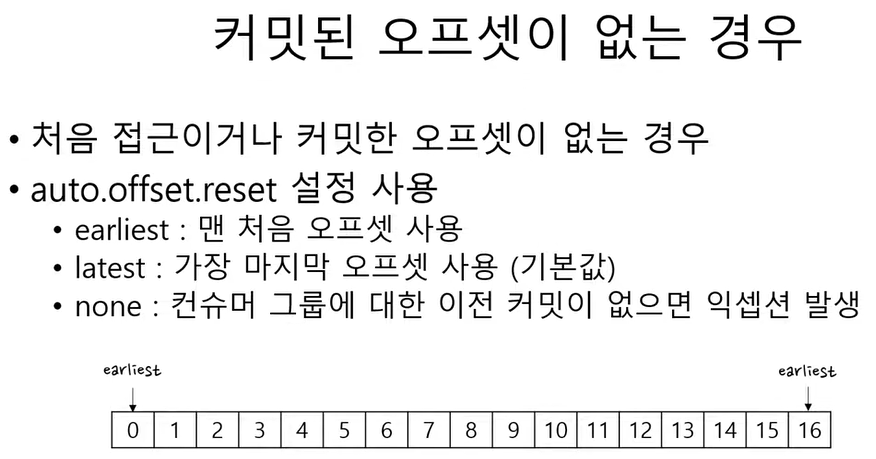

<br>

위 이미지는 카프카(Kafka)에서의 Consumer 동작 방식 중 오프셋 초기화 전략(auto.offset.reset 속성)에 관한 내용을 설명.

<br>

### auto.offset.reset 설정 옵션

<br>

### `earliest`

가장 초기의 오프셋부터 메시지를 시작하여 가져온다. 위 이미지에서는 0이라는 위치로 표시되어 있다. 이 설정은 Consumer가 처음 시작될 때나, 저장된 오프셋이 더 이상 유효하지 않은 경우(예: 해당 오프셋의 메시지가 이미 삭제된 경우) 사용된다.

<br>

### `latest`

가장 최근의 오프셋부터 메시지를 가져온다. 이는 Consumer가 동작 중일 때 새로운 메시지만 가져오고 싶을 때 사용한다.

<br>

### `none`

이 설정은 저장된 오프셋이 없을 때 예외를 발생시킵다. 즉, 저장된 오프셋 정보가 없거나 유효하지 않은 경우 Consumer는 동작을 중지하게 된다.

<br><br>

위 설정은 Consumer가 메시지를 가져오기 시작하는 위치를 결정하는 중요한 역할을 한다. 예를 들어, earliest를 설정하면 Consumer는 토픽의 시작부터 모든 메시지를 가져오게 되며, latest를 설정하면 Consumer는 가장 최근에 추가된 메시지만 가져오게 된다. 

이러한 선택은 애플리케이션의 요구사항과 데이터 처리 전략에 따라 결정된다.

<br><br><br>

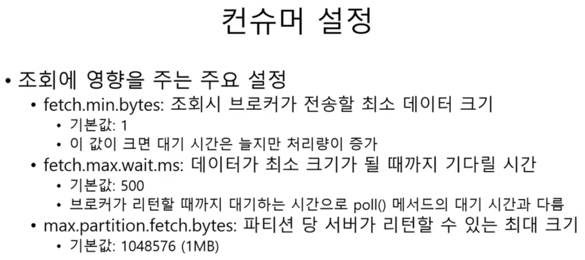

<br>

위 이미지는 카프카(Kafka) Consumer의 데이터 가져오기(fetch) 관련 설정에 대해 설명하고 있다.

<br>

### `fetch.min.bytes`

Consumer가 데이터를 가져오기 시작하기 위해 필요한 최소 바이트 수다.

`기본값: 1` : 이는 Consumer가 최소 1바이트의 데이터만 있어도 데이터를 가져올 수 있다는 것을 의미한다.

`주요 포인트`: 기본값 설정을 높게 하면, Consumer는 더 큰 양의 데이터가 쌓일 때까지 기다린 다음 가져오게 된다. 이같은 방법은 네트워크 I/O를 줄이고 효율성을 높이기 위한 전략으로 사용될 수 있다.

<br>

### `fetch.max.wait.ms`

Consumer가 fetch.min.bytes 설정에 따른 최소 바이트 수를 충족하기 위해 기다리는 최대 시간이다.

`기본값: 500 밀리초(ms)`

`주요 포인트`: 만약 설정된 시간 동안 fetch.min.bytes에 지정된 바이트 수가 충족되지 않더라도, 해당 시간이 지나면 Consumer는 현재 사용 가능한 데이터를 가져오게 된다.

<br>

### `max.partition.fetch.bytes`

Consumer가 한 번의 poll() 요청으로 각 파티션에서 가져올 수 있는 최대 바이트 수다.

`기본값: 1048576 바이트, 즉 1MB`

`주요 포인트` : 이 설정은 각 파티션에서 가져오는 데이터의 크기를 제한한다. 이를 통해 Consumer가 너무 많은 데이터를 한 번에 처리하는 것을 방지하며, 메모리 사용량을 관리할 수 있다.

<br>

이 설정들은 카프카 Consumer의 성능과 효율성을 최적화하기 위해 중요하다.

<br><br><br>

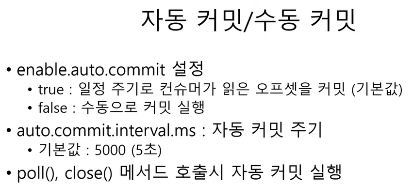

<br>

### poll(), close()

이 두 메서드는 offset 커밋과 관련된 작업을 수행한다.

**poll()**: Consumer가 카프카에서 새로운 메시지를 가져오는 동안, 설정된 auto.commit.interval.ms 주기에 따라 offset을 자동 커밋할 수 있다.

**close()**: Consumer가 종료되기 전에 마지막으로 읽은 메시지의 offset을 커밋한다.

주요 포인트: 올바른 offset 관리는 메시지 중복 처리나 누락을 방지하는데 중요하다.

<br>

<br><br><br>

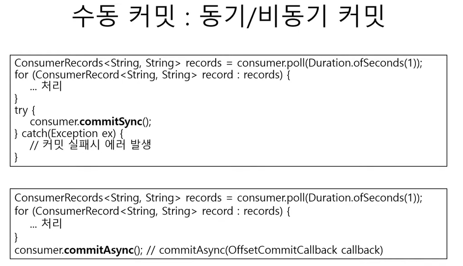

<br>

### 동기 커밋 (commitSync)

```java
ConsumerRecords<String, String> records = consumer.poll(Duration.ofSeconds(1));
```

Kafka의 토픽에서 메시지를 가져오는 코드다. 위 코드는 1초 동안 메시지를 기다린다.

<br>

```java
for (ConsumerRecord<String, String> record : records) { ... }: 
```

가져온 메시지를 순회하며 처리하는 루프다.

<br>

```java
consumer.commitSync();
```

처리한 메시지의 offset을 동기적으로 커밋한다.

commitSync 메서드는 커밋 요청이 성공할 때까지 블로킹된다. 만약 커밋이 실패하면 예외가 발생한다.

동기 커밋은 처리가 확실하고 예측 가능하지만, 커밋에 실패할 경우 리트라이 메커니즘을 구현해야 한다.

<br>

### 비동기 커밋 (commitAsync)

```java
ConsumerRecords<String, String> records = consumer.poll(Duration.ofSeconds(1));
```

위의 코드와 마찬가지로 Kafka의 토픽에서 메시지를 가져오는 코드다.

<br>

```java
for (ConsumerRecord<String, String> record : records) { ... }
```

가져온 메시지를 순회하며 처리하는 루프다.

<br>

```java
consumer.commitAsync(OffsetCommitCallback callback);
```

처리한 메시지의 offset을 비동기적으로 커밋한다.

commitAsync는 즉시 반환되며, 성공 또는 실패에 대한 콜백을 받을 수 있다.

비동기 커밋은 빠르고, 블로킹이 없으므로 처리 속도가 빠르다. 하지만 실패한 커밋에 대해 자동으로 재시도하지 않는다.

<br><br><br>

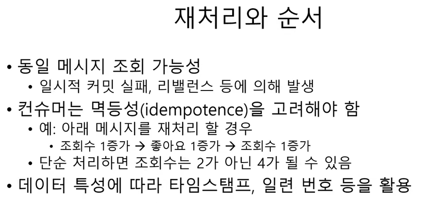

<br>

### 멱등성(idempotence)

멱등성은 데이터 처리에서 매우 중요한 개념이다. 

예를 들어, 한 사용자가 물건을 구매하는 결제 요청을 보냈을 때, 네트워크 문제로 인해 같은 요청을 여러 번 보내게 될 수 있다. 멱등성이 보장되지 않으면, 사용자는 같은 물건을 여러 번 구매하게 될 수 있다. 

따라서, 시스템은 같은 요청을 여러 번 받아도 한 번만 처리하거나, 동일한 결과를 반환해야 한다.

<br>

위의 개념은 데이터를 안전하게 처리하기 위해 중요하며, 특히 분산 시스템, 네트워크 통신, 데이터베이스 등에서 자주 다루어진다.

<br><br><br>

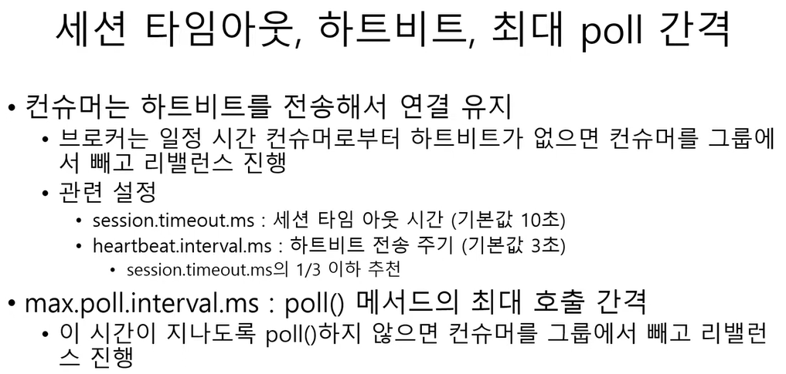

<br>

### 리밸런싱 (Rebalancing)

Kafka에서 리밸런싱은 Consumer Group 내의 Consumer들 사이에 파티션을 재분배하는 과정을 말한다.

<br>

### 왜 리밸런싱이 필요한가 ❓

**`Consumer 추가/제거`**: Consumer Group에 새로운 Consumer가 추가되거나 기존의 Consumer가 제거될 때, 파티션의 분배가 필요하다.

**`파티션 추가`**: 토픽에 새로운 파티션이 추가될 경우, 이 새 파티션을 소비하기 위해 파티션 분배가 필요하다.

**`Consumer 장애`**: 어떤 Consumer가 장애로 인해 동작하지 않게 되면, 그 Consumer가 담당하던 파티션들을 다른 Consumer들에게 분배해야 한다.

<br>

### 어떻게 동작하는가 ❓

리밸런싱 시작 시, Consumer Group 내의 모든 Consumer는 현재 소비 중인 파티션에서 분리된다.

그 후, Group Coordinator는 새로운 파티션 할당을 결정하고 각 Consumer에게 알린다.

각 Consumer는 새로 할당된 파티션들을 시작점(예: 가장 마지막으로 커밋된 오프셋)부터 소비하기 시작한다.

<br>

### 리밸런싱의 영향

리밸런싱은 필요한 작업이지만, 과정 중에는 해당 Consumer Group의 메시지 소비가 일시적으로 중단될 수 있다.

리밸런싱이 빈번하게 발생하면, 전체 시스템의 처리량과 성능에 영향을 줄 수 있기 때문에, 이를 최소화하는 설정과 전략이 필요하다.

위 이미지에서 언급된 session.timeout.ms 및 heartbeat.interval.ms는 리밸런싱과 관련된 설정값이다. 

`heartbeat.interval.ms`는 Consumer가 Group Coordinator에게 "나 아직 살아있어!"라고 알리는 신호를 보내는 주기를 설정하며, `session.timeout.ms`는 해당 신호를 받지 못했을 때 Consumer를 장애로 판단하고 리밸런싱을 시작하는 시간을 결정한다.

<br><br><br>

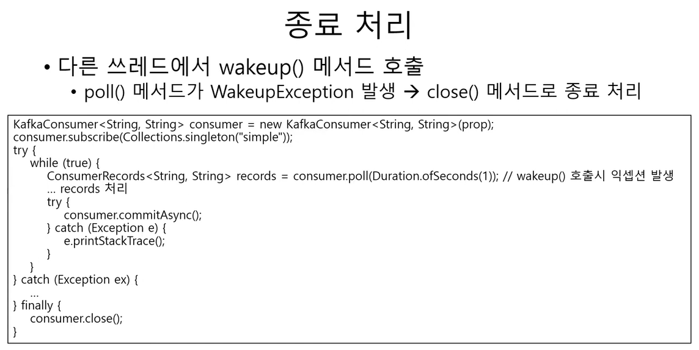

<br>

<br><br><br>

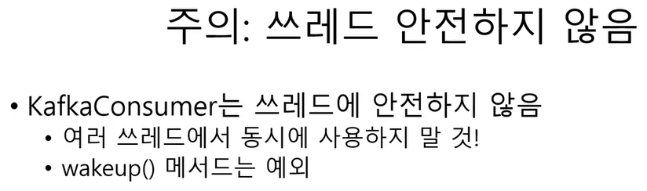

<br>

Apache Kafka에서의 Consumer는 스레드에 안전하지 않다. 이는 KafkaConsumer의 인스턴스가 여러 스레드에 의해 동시에 액세스될 때 안정적인 동작을 보장하지 않는다는 것을 의미한다.

<br>

### 왜 KafkaConsumer는 스레드에 안전하지 않은가?

KafkaConsumer의 내부 구조와 상태 관리 방식은 단일 스레드에서 동작하기 위해 설계되었다.

여러 스레드에서 동시에 KafkaConsumer의 메서드를 호출하게 되면, 그 상태와 동작이 예기치 않게 변경될 수 있어 데이터 손실 또는 중복 처리와 같은 문제가 발생할 수 있다.

<br>

### 그렇다면 병렬 처리는 어떻게 해야 하나?

병렬 처리를 위해선 각 스레드마다 별도의 KafkaConsumer 인스턴스를 사용해야 합니다. 

이렇게 하면 각 스레드는 독립적으로 메시지를 소비할 수 있다.

<br>

### wakeup() 메서드는 무엇인가?

wakeup()은 KafkaConsumer가 poll() 메서드를 호출 중일 때, 이를 중단시키기 위한 메서드다.

다른 스레드에서 이 메서드를 호출하면 poll()이 실행 중인 스레드는 WakeupException을 발생시키고 중단된다.

이 기능은 주로 KafkaConsumer가 긴 poll() 작업을 수행하는 동안 그 작업을 강제로 종료시키기 위해 사용된다. 예를 들어, 즉각적인 종료가 필요한 상황에서 유용합니다.

<br>

결론적으로, KafkaConsumer를 사용할 때는 스레드에 안전하게 동작하도록 주의가 필요하며, 병렬 처리가 필요한 경우 각 스레드에 독립적인 KafkaConsumer 인스턴스를 할당해야 한다.

<br><br><br>