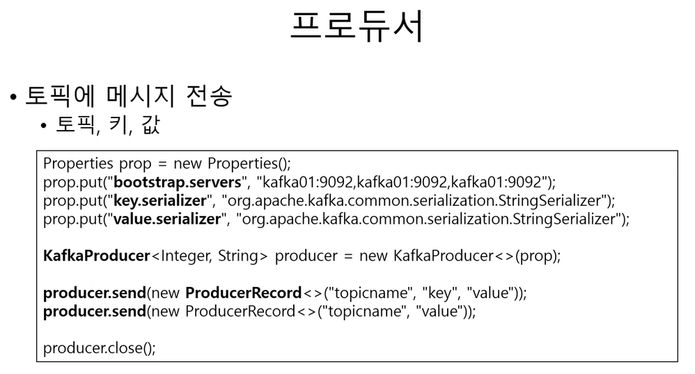
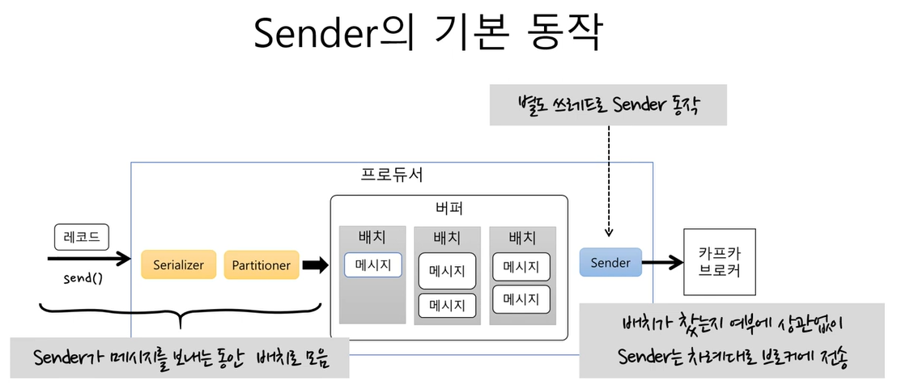
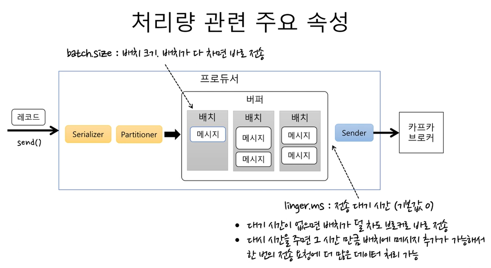
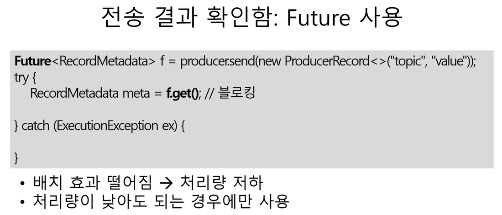
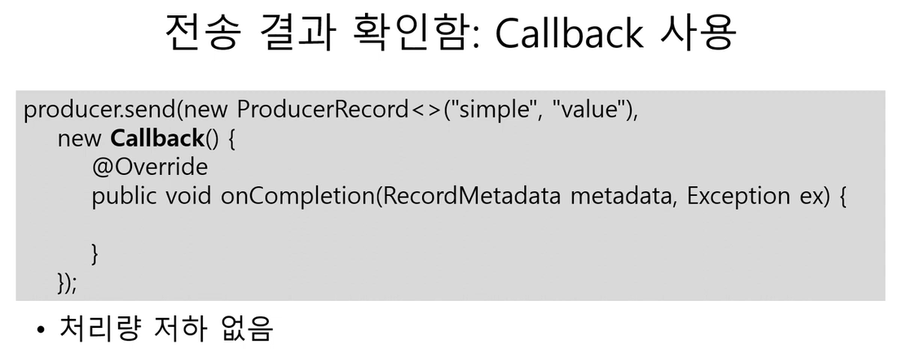
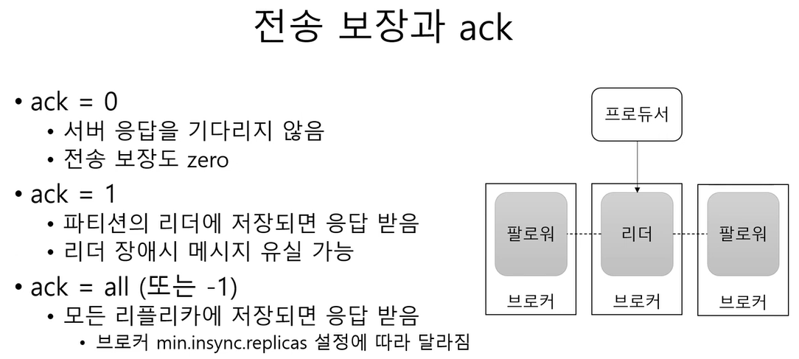
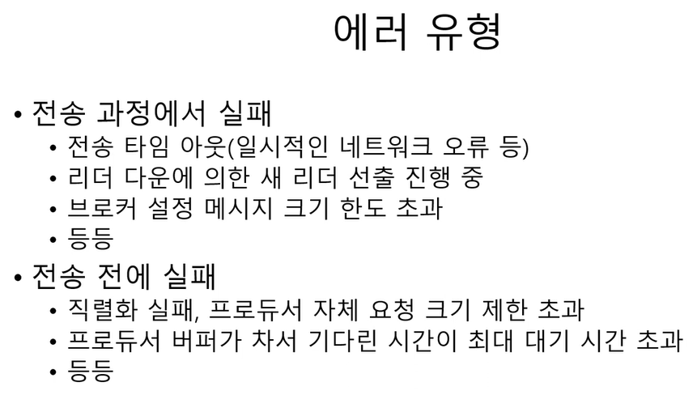
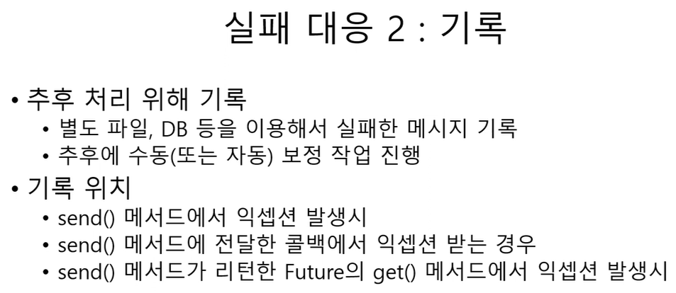
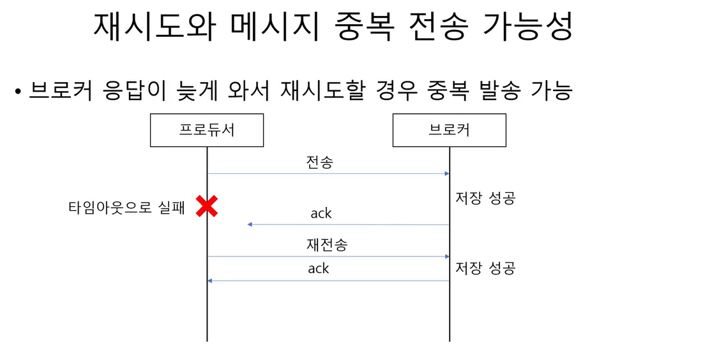
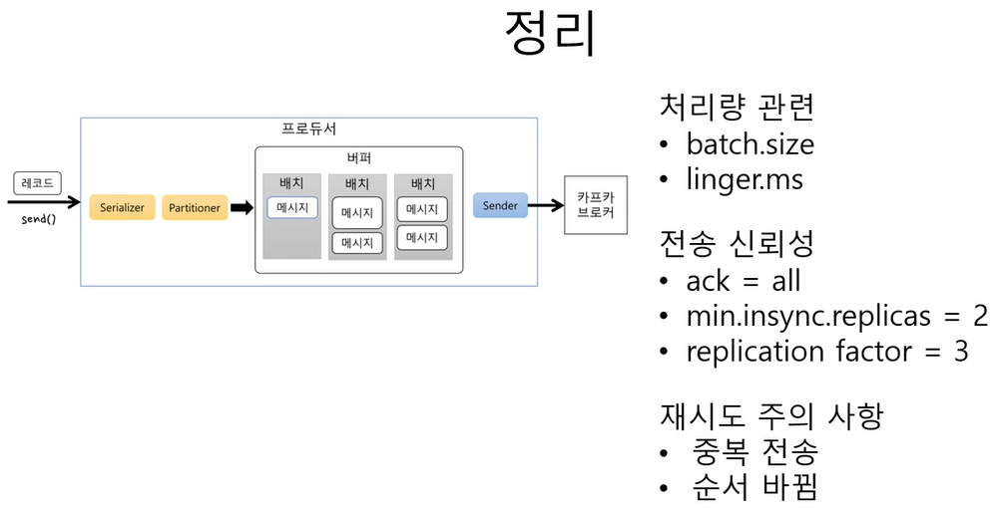

# Kafka Producer

### [Kafka 공식 문서](https://kafka.apache.org/)

<br>



<br>

Producer는 Kafka에 데이터를 전송하는 클라이언트 어플리케이션이다. 이 데이터는 메시지로 토픽에 저장된다.

<br>

### Topic

Kafka에서 메시지는 토픽이라는 카테고리에 저장된다. 토픽은 여러 파티션으로 나누어져 있어 확장성과 병렬 처리가 가능하다.

<br>

### Key

키를 사용하여 메시지를 특정 파티션에 전송할 수 있다. 키가 주어지지 않으면 메시지는 라운드 로빈 방식으로 파티션에 전송된다.

<br>

### Value

실제로 토픽에 저장될 데이터를 나타낸다.

<br><br>

### Kafka에 메시지를 전송하는 기본적인 방법

<br>

#### Properties 설정

````java
Properties prop = new Properties();
````

<br>

#### Kafka 클러스터의 브로커 주소들을 명시

```java
prop.put("bootstrap.servers", "kafka01:9092,kafka01:9092,kafka01:9092");
```

여기서는 같은 주소가 중복으로 사용되었으나, 실제 환경에서는 서로 다른 브로커의 주소를 명시해야 한다.

<br>

#### 데이터 형식을 직렬화하기 위한 Serializer 클래스를 지정

```java
prop.put("key.serializer",  "org.apache.kafka.common.serialization.StringSerializer");
prop.put("value.serializer", "org.apache.kafka.common.serialization.StringSerializer");
```

메시지의 키와 값의 데이터 형식을 직렬화하기 위한 Serializer 클래스를 지정한다. 여기서는 문자열을 직렬화하는 StringSerializer를 사용했다.

<br>

#### KafkaProducer 객체 생성

```java
KafkaProducer<Interger, String> producer = new KafkaProducer<>(prop);
```

설정한 속성을 사용하여 Kafka 프로듀서 객체를 생성.

<br>

#### 메시지 전송

```java
producer.send(new ProducerRecord<>("topicname", "key", "value"));
```

```java
producer.send(new ProducerRecord<>("topicname", "value"));
```

<br>

#### Producer 종료

```java
producer.close();
```

<br><br><br>


<br>

Kafka 프로듀서의 동작에 대한 기본 흐름을 살펴보자.

<br>

#### send()

프로듀서 어플리케이션에서 send() 메서드를 호출하여 메시지를 Kafka에 전송하려고 시도하는 과정. 해당 메서드에는 메시지의 키와 값, 그리고 대상 토픽이 포함된다.

<br>

#### Serializer

메시지의 키와 값은 바이트 배열로 변환되어야 Kafka 브로커에 저장될 수 있다. Serializer는 이 변환 과정을 수행한다. 프로듀서 설정에서는 키와 값에 대해 어떤 Serializer를 사용할지 지정된다. 예를 들어, 문자열 데이터에 대해서는 StringSerializer가 사용될 수 있다.

<br>

#### Partitioner

Partitioner는 메시지가 저장될 토픽의 파티션을 결정한다. 메시지의 키와 파티션 전략을 기반으로 특정 파티션을 선택하게 된다. 만약 키가 제공되지 않으면, 라운드 로빈 방식 등 다른 전략을 사용하여 파티션을 선택할 수 있다.

<br>

#### 버퍼

send()를 호출할 때, 메시지는 바로 브로커로 전송되지 않는다. 대신, 메시지는 내부적인 버퍼에 임시로 저장된다. 이 버퍼 내에서 메시지들은 배치로 그룹화된다. 이러한 배치 처리 방식은 네트워크 효율성을 높여준다.

<br>

#### sender

별도의 스레드(일반적으로 "sender" 스레드라고 불림)가 배치된 메시지들을 버퍼에서 가져와 실제로 Kafka 브로커에 전송한다.

<br>

#### 카프카 브로커

메시지가 브로커에 도달하면, 해당 메시지는 지정된 토픽의 파티션에 저장된다. 브로커는 메시지의 영구 저장과, 컨슈머에게 메시지를 전달하는 역할을 한다.

<br><br><br>



<br><br><br>



<br><br><br>


<br>

Kafka Producer는 send() 메서드를 사용하여 메시지를 Kafka 브로커에 전송한다. 이 메서드는 비동기적으로 동작하기 때문에 호출 후 즉시 반환된다.

<br>

### **비동기 전송**

위 코드는 메시지를 Kafka 브로커로 비동기적으로 전송한다. 이 때문에 send() 메서드는 메시지 전송이 성공했는지, 실패했는지에 대한 정보를 즉시 제공하지 않는다.

<br>

### **전송 실패**

메시지 전송이 실패하면 이를 알 수 없다. 예를 들어, 네트워크 문제, 브로커 장애, 토픽이 존재하지 않는 경우 등 여러 이유로 메시지 전송이 실패할 수 있다.

<br>

### **에러 처리**

별도의 에러 처리 로직이 없기 때문에 전송 실패에 대해 추가 조치를 취할 수 없다.

<br>

결론적으로, Kafka 프로듀서의 send() 메서드를 사용할 때는 전송 결과를 어떻게 처리할지, 어떤 유형의 메시지를 전송하는지를 고려하여 적절한 전략을 선택해야 한다. 필요한 경우, send() 메서드의 결과를 확인하고 에러 처리 로직을 추가할 수 있다.

<br><br><br>



<br>

### 로직

send() 메서드는 메시지를 브로커에 전송한 후, 해당 메시지의 전송 결과에 대한 Future 객체를 반환한다.

f.get()는 Future 객체의 결과를 가져온다. 이 호출은 메시지의 전송이 완료될 때까지 블로킹된다 (즉, 현재 스레드를 멈춤). 메시지 전송이 성공하면 RecordMetadata 객체가 반환되며, 이 객체에는 메시지가 저장된 토픽, 파티션, 오프셋 등의 메타데이터 정보가 포함된다.

catch 블록은 메시지 전송 중 오류가 발생했을 때 실행된다. ExecutionException을 사용하여 오류 내용을 확인하고 적절한 처리를 수행할 수 있다.

<br>

### 배치 효과와 처리량

Kafka 프로듀서는 메시지를 배치로 그룹화하여 효율적으로 브로커에 전송한다. 그러나 Future를 사용하여 각 메시지의 전송 결과를 개별적으로 확인하는 경우, 이 배치 효과가 떨어질 수 있다.

이로 인해 전체 처리량이 저하될 수 있다. 이는 메시지 전송 후 결과를 기다리는 동안 다른 메시지 전송이 대기 상태에 머무를 수 있기 때문이다.

<br>

결론적으로, Future를 사용하여 메시지 전송 결과를 확인하는 방법은 결과의 정확성이 중요한 경우에 유용하지만, 높은 처리량이 요구되는 환경에서는 적합하지 않을 수 있다.

<br><br><br>



<br>

Kafka 프로듀서는 메시지를 비동기적으로 브로커에 전송할 때 결과를 확인하는 두 가지 주요 방법을 제공한다: Future와 Callback. 

이 중 Callback 방식은 메시지 전송이 완료되었을 때 특정 동작을 수행하도록 설정된 콜백 함수를 호출하는 방법이다.

<br>

### 로직

producer.send() 메서드는 메시지를 Kafka 브로커에 전송한다. 이 메서드는 두 번째 인자로 Callback 객체를 받아 메시지 전송이 완료되었을 때 호출된다.

onCompletion 메서드는 메시지 전송이 성공적으로 완료되었거나 오류가 발생했을 때 호출된다.

RecordMetadata metadata: 메시지 전송이 성공적으로 완료된 경우 제공되는 메타데이터다. 여기에는 메시지가 저장된 토픽, 파티션, 오프셋 등의 정보가 포함된다.

Exception ex: 메시지 전송 중 오류가 발생한 경우 제공되는 예외 객체.

<br>

### Callback의 장점

**비동기 처리**: Callback을 사용하면 메시지 전송 후 결과를 기다리지 않고 다른 작업을 계속 수행할 수 있다. 메시지 전송이 완료되면 Callback의 onCompletion 메서드가 호출되어 결과에 따라 추가 작업을 수행할 수 있다.

**배치 효과 유지**: Future 방식과 달리 Callback 방식은 메시지 전송 결과를 비동기적으로 처리하기 때문에 배치 효과를 그대로 유지하면서 처리량을 저하시키지 않는다.

**에러 핸들링**: 메시지 전송 중 오류가 발생한 경우 Exception ex를 통해 오류 정보를 얻고 적절한 조치를 취할 수 있다.

<br>

결론적으로, Callback 방식은 Kafka에서 메시지 전송 결과를 비동기적으로 처리하면서 높은 처리량을 유지하려는 경우에 유용하다.

<br><br><br>



<br><br><br>


<br><br><br>


<br>

### ack (Acknowledgment)

`ack = 0`: 이 설정은 최대 성능과 최소 지연 시간을 목표로 한다. 프로듀서는 카프카에 메시지를 전송하고 전송 성공 여부를 확인하지 않는다.

`ack = 1`: 메시지가 파티션의 리더에게 성공적으로 저장되면 프로듀서에게 응답한다. 그러나 다른 리플리카들에 대해서는 확인하지 않기 때문에, 리더가 실패하면 메시지가 손실될 수 있다.

`ack = all (또는 -1)`: 모든 리플리카가 메시지를 성공적으로 저장했을 때만 프로듀서에게 응답한다. 이는 메시지 전송의 가장 높은 수준의 보장을 제공하지만, 성능은 ack=1보다 느릴 수 있다.

<br>

### min.insync.replicas

min.insync.replicas는 ack가 all로 설정된 경우, 메시지가 성공적으로 저장되었다고 간주하기 전에 동기화된 리플리카들의 최소 개수를 지정한다.

<br>

### 실제 사용 예시

Kafka 토픽 설정에 관한 예제 YAML 파일

```yaml
apiVersion: kafka.strimzi.io/v1beta1
kind: KafkaTopic
metadata:
  name: my-topic
  labels:
    strimzi.io/cluster: my-cluster
spec:
  partitions: 3
  replicas: 3
  config:
    retention.ms: 7200000
    segment.bytes: 1073741824
    min.insync.replicas: 2
    # ... 기타 설정들 ...
```

<br>

위 예제에서, 토픽은 3개의 파티션과 3개의 리플리카를 가지며, 각 메시지에 대해 최소 2개의 리플리카가 동기화될 때까지 기다린다.

실제로는 Kafka 프로듀서 애플리케이션의 설정에서 ack를 설정해야 한다. 

Java에서 Kafka 프로듀서를 설정할 때 ack를 "all"로 설정하려면:

```java
Properties props = new Properties();
props.put("bootstrap.servers", "kafka-broker:9092");
props.put("acks", "all");
// ... 기타 프로듀서 설정 ...
```

<br><br><br>



<br><br><br>


<br><br><br>



<br><br><br>



<br><br><br>


<br>

### max.in.flight.requests.per.connection:

위 설정의 값이 5일 경우, 이는 한 번에 5개의 비동기 메시지 전송 요청이 이루어질 수 있음을 의미한다.

<br>

```java
Properties props = new Properties();
props.put("bootstrap.servers", "kafka-broker:9092");
props.put("acks", "all");
props.put("max.in.flight.requests.per.connection", "5");
```

<br><br><br>

