# Kafka 기본 구조

### [Kafka 공식 문서](https://kafka.apache.org/)

  

### Kafka란 : 분산 이벤트 스트리밍 플랫폼

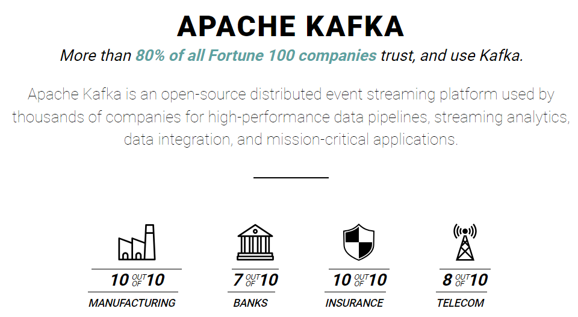

   

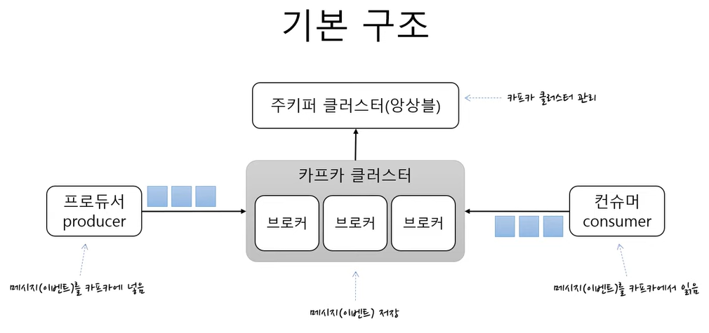

  

#### Kafka Cluster

* 여러 개의 브로커로 구성된 Kafka의 집합을 의미.

* 클러스터를 통해 데이터의 분산 저장 및 처리.

 

#### Broker

* Kafka 시스템의 기본 서버 단위.

* 브로커는 클라이언트로부터 메시지를 받아 저장하고, 클라이언트가 요청할 때 메시지를 전달.

* 카프카 클러스터는 여러 브로커로 구성될 수 있다.

 

#### Producer

* 데이터 또는 메시지를 생성하고 카프카 브로커에 전달하는 역할을 하는 클라이언트 애플리케이션. 

* 예를 들면, 로그 데이터를 생성하는 서버 등이 프로듀서의 역할을 할 수 있다.

 

#### Consumer

* 카프카 브로커에서 메시지를 가져와 처리하는 클라이언트 애플리케이션. 

* 컨슈머는 특정 토픽의 데이터를 구독하며, 새로운 메시지가 들어오면 이를 가져와서 처리.

 

#### ZooKeeper Ensemble

* Apache ZooKeeper는 분산 시스템의 설정 정보, 네이밍 등을 관리하기 위한 서비스. 

* 카프카는 메타데이터와 브로커의 상태, 리더 선출 등의 중요한 작업을 위해 ZooKeeper와 연동되어 동작한다. 

* 여러 개의 주키퍼 인스턴스로 구성된 것을 앙상블이라고 하며, 고가용성을 위해 주로 홀수 개의 인스턴스로 구성된다.

   

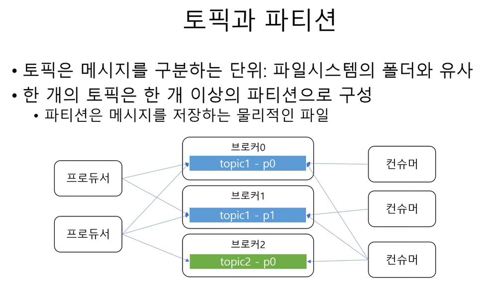

   

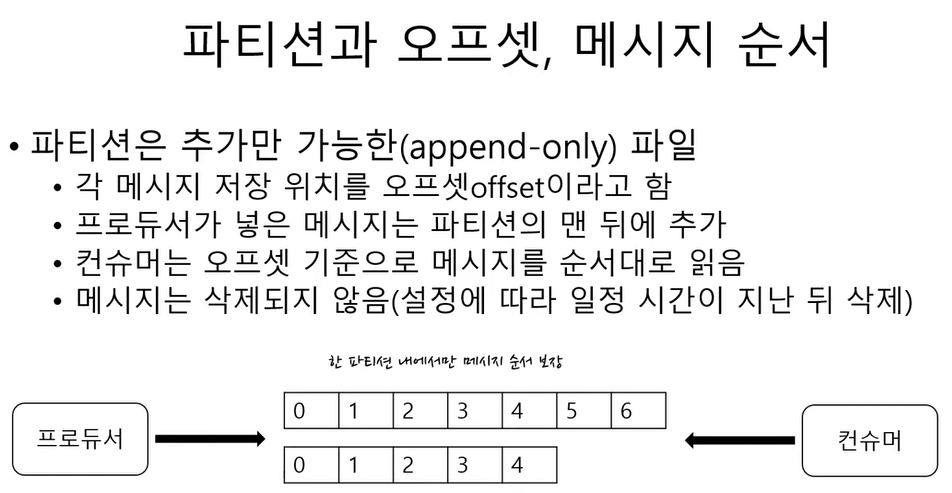

   

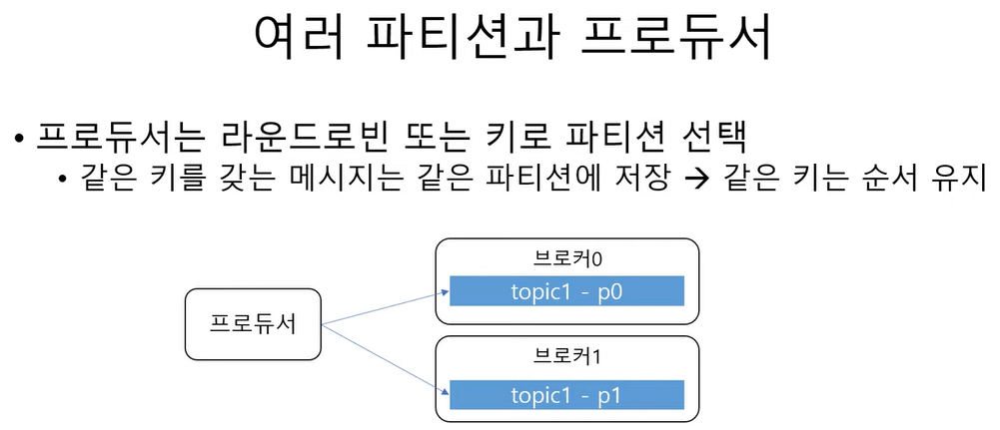

 

#### 1. 라운드로빈 방식

프로듀서는 순차적으로 각 파티션에 메시지를 저장한다.  
특정 파티션을 선호하지 않고, 균등하게 메시지를 분산하고 싶을 때 사용한다.

 

#### 2. 키 기반 파티션 방식

각 메시지는 키와 함께 제공될 수 있다. 프로듀서는 이 키를 사용하여 메시지를 특정 파티션에 저장한다.  
같은 키를 가진 메시지는 항상 같은 파티션에 저장된다. 이 방식은 특정 키에 대한 메시지의 순서를 보장하고 싶을 때 사용된다.

  

**Round Robin** : 프로세스들 사이에 우선순위를 두지 않고, 순서대로 시간단위로 CPU를 할당하는 방식.

   

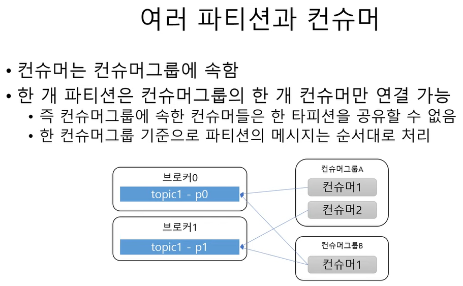

 

### 중요 포인트

* 한 파티션의 메시지는 하나의 컨슈머에 의해 순차적으로 소비됩니다. 따라서 파티션 내의 메시지 순서는 보장된다.

* 컨슈머 그룹에 속한 컨슈머들은 하나의 파티션을 공유할 수 없다.

   

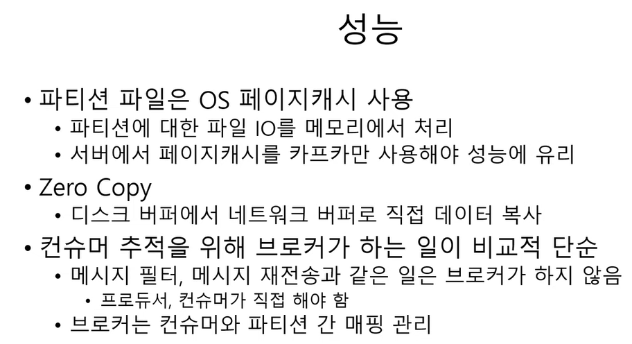

   

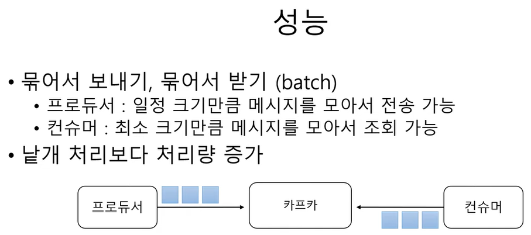

   

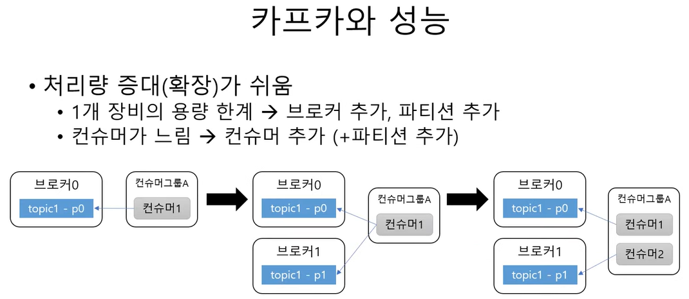

   

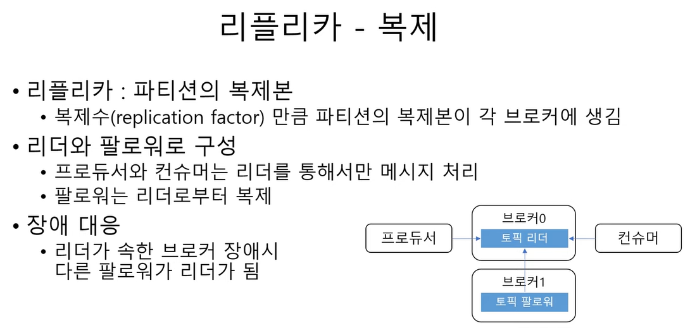

   

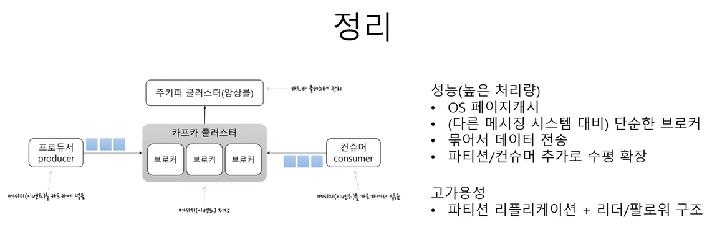