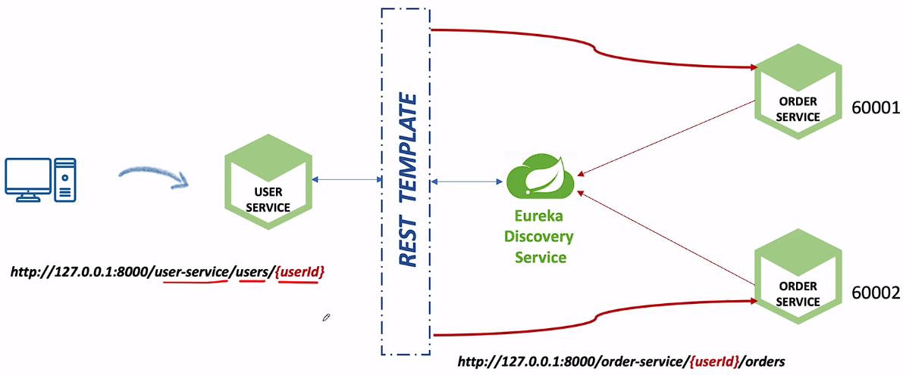
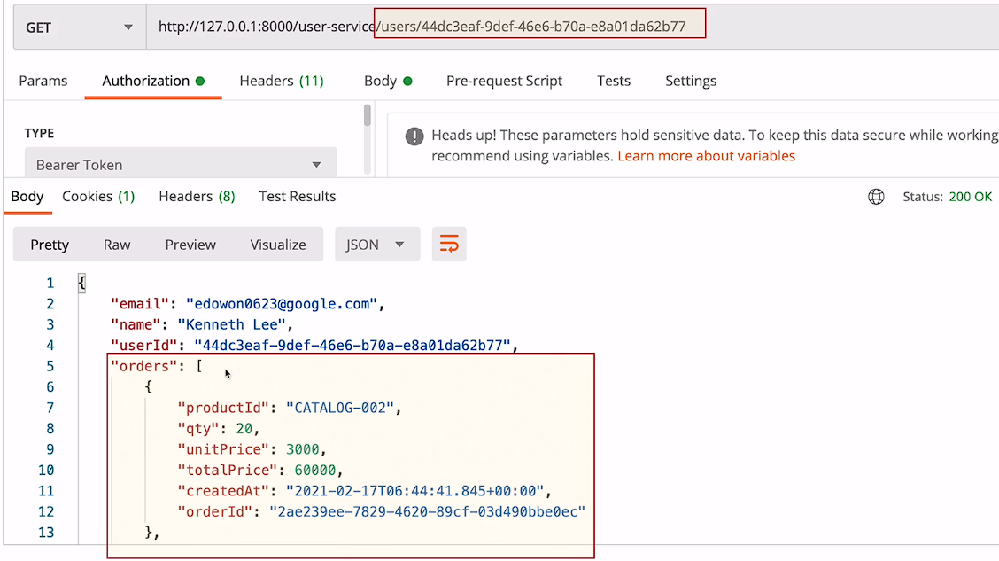
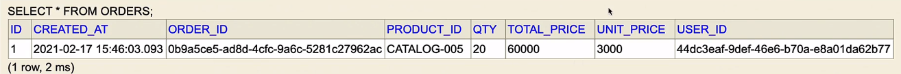

# MSA 통신, RestTemplate 개요와 활용

[RestTemplate - Spring 공식 문서](https://docs.spring.io/spring-framework/reference/integration/rest-clients.html#rest-resttemplate-uri)

<br>

## Communication Types

<br>

### Synchronous HTTP communication

* 일반적으로 RESTful 웹 서비스에 사용되는 동기 통신 방식.
  * 클라이언트는 서버에 요청을 보내고, 서버는 응답을 반환. 
  * 클라이언트는 응답이 도착할 때까지 기다린다.

<br>

### Asynchronous communication over AMQP

* AMQP(Advanced Message Queuing Protocol)는 비동기 메시지 전달을 위한 표준 프로토콜.
  * 이 통신 방식은 일반적으로 마이크로 서비스 간에 메시지를 교환하는 데 사용. 
  * 서버는 클라이언트에게 즉시 응답을 보내고, 이후에 별도의 처리를 수행할 수 있다.

<br><br><br>

### Rest Template

<br>

* 마이크로 서비스들은 기본적으로 REST API를 통해 각 서비스 들끼리 호출하고 응답하는 구조로 이루어져 있다.


* `Rest Template`은 마이크로 서비스끼리 통신하는 한 가지 방법이다.

<br>

### `Rest Template 클래스의 주요 메서드`

| 용어  | 설명  |
|-----|-----|
|getForObject|GET 요청을 사용하여 표현을 검색|
|`getForEntity`|GET을 사용하여 ResponseEntity(즉, 상태, 헤더, 본문)를 검색|
|headForHeaders|HEAD를 사용하여 리소스의 모든 헤더를 검색|
|postForLocation|POST를 사용하여 새 리소스를 생성하고 응답으로부터 Location 헤더를 반환|
|postForObject|POST를 사용하여 새 리소스를 생성하고 응답으로부터 표현을 반환|
|`postForEntity`|POST를 사용하여 새 리소스를 생성하고 응답으로부터 ResponseEntity를 반환|
|`put`|PUT을 사용하여 리소스를 생성하거나 업데이트|
|patchForObject|PATCH를 사용하여 리소스를 업데이트하고 응답으로부터 표현을 반환|
|`delete`|DELETE를 사용하여 지정된 URI의 리소스를 삭제|
|optionsForAllow|ALLOW를 사용하여 리소스에 대한 허용된 HTTP 메서드를 검색|
|`exchange`|RequestEntity(HTTP 메서드, URL, 헤더, 본문 포함)를 입력으로 받고 ResponseEntity를 반환|
|execute|리퀘스트 준비와 응답 처리에 대한 전체적인 제어 가능|


<br><br>



<br><br><br>

### Rest Template 예제 1️⃣

<br>

#### UserServiceApplication

```java
@SpringBootApplication
@EnableDiscoveryClient
public class UserServiceApplication {
    public static void main(String[] args) {
        SpringApplication.run(UserServiceApplication.class, args);
    }
    
    @Bean
    public BCryptPasswordEncoder passwordEncoder() {
        return new BCryptPasswordEncoder();
    }
    
    @Bean
    public RestTemplate getRestTemplate() {
        return new RestTemplate();
    }
}
```

<br>

#### UsersController

```java
@GetMapping(value="/users/{userId}", produces = {MediaType.APPLICATION_JSON_VALUE})
public ResponseEntity<ResponseUser> getUser(@PathVariable("userId") String userId) {
    UserDto userDto = userService.getUserByUserId(userId);
    ResponseUser returnValue = new ModelMapper().map(userDto, ResponseUser.class);
    
    return ResponseEntity.status(HttpStatus.OK).body(returnValue);
}
```
<br>

#### UserServiceImpl

```java
@Override
public UserDto getUserByUserId(String userId){
    UserEntity userEntity = userRepository.findByUserId(userId);
    
    if(userEntity == null)
        throw new UsernameNotFoundException("User not found");
    
    UserDto userDto = new ModelMapper().map(userEntity, UserDto.class);
    
    String orderUrl = String.format(env.getProperty("order_service.url"), userId);
    ResponseEntity<List<ResponseOrder>> orderListResponse = 
        restTemplate.exchange(orderUrl, HttpMethod.GET, null,
            new ParameterizedTypeReference<List<ResponseOrder>>() {
        });
    
    List<ResponseOrder> ordersList = orderListResponse.getBody();
    userDto.setOrders(ordersList);
    
    return userDto;
}
```
<br>

위 예제에서는 `Rest Template`을 사용하여 주문 서비스(Order Service)와 통신하고 있다. 

사용자 정보를 가져올 때 해당 사용자의 주문 정보도 함께 가져오는 것을 볼 수 있다.

`Rest Template`의 `exchange 메서드`를 사용하여 주문 서비스에 `HTTP GET 요청`을 보내고, 주문 정보를 포함한 응답을 받아 사용자 DTO에 설정한다.

<br>

`Rest Template`의 메서드들은 반환 타입을 지정하기 위해 Class 객체를 사용하지만, 이 방법은 제네릭 타입 정보를 유지하지 못하는 `타입 소거(Type Erasure) 문제`를 가지고 있다. 

* 이 문제를 해결하기 위해 `ParameterizedTypeReference`가 사용된다, 이 클래스는 실행 시간에 제네릭 타입 정보를 유지하면서 복잡한 제네릭 타입을 안전하게 반환받을 수 있게 한다. 


* 예를 들어, List<MyClass>와 같은 제네릭 타입의 객체를 반환받기 위해 `Rest Template`의 `exchange 메서드`에 `ParameterizedTypeReference`를 사용할 수 있다.

<br>

#### user-service.yml

```yml
order_service:
  url: http://127.0.0.1:8000/order-service/%s/orders
```

<br><br>

### 성공 시,



<br><br>



<br><br><br>