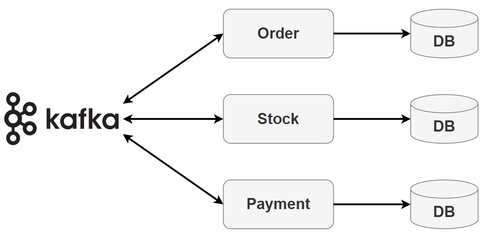
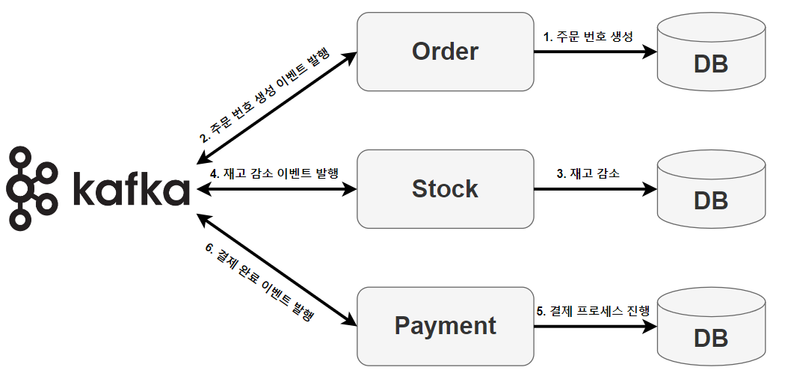
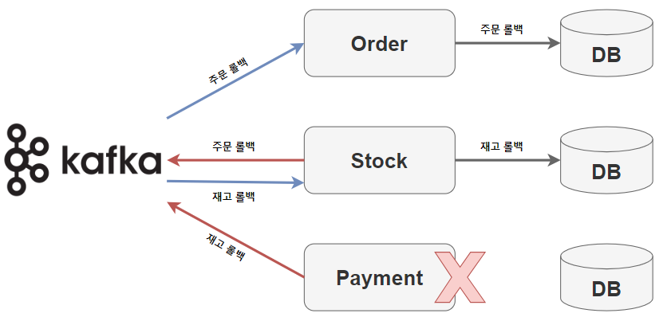

# Saga 패턴을 이용한 분산 트랜잭션 제어 - Choreography

<br>

## 분산 트랜잭션

분산 트랜잭션은 여러 개의 독립적인 시스템 또는 서비스 간에 트랜잭션을 관리해야 할 때 발생합니다.

MSA (Microservices Architecture) 환경에서는 서비스들이 각각 독립적으로 운영되므로, 한 번의 사용자 요청이 여러 서비스에 걸쳐 데이터를 변경할 필요가 있을 때 이러한 분산 트랜잭션을 제어해야 한다.

<br>

### 분산 트랜잭션을 왜 제어해야 하는가 ?

예를 들어, 결제, 주문, 재고라는 3가지 서비스가 있을 때의 시나리오를 생각해보자.

<br>

#### 원자성 (Atomicity)

MSA 환경에서 여러 서비스에 걸친 작업은 모두 성공하거나 모두 실패해야 한다.

예를 들어, 결제가 완료되었지만 주문 서비스에서 오류가 발생해 주문이 처리되지 않았다면, 결제만 발생한 상태가 된다.

이런 상황을 방지하기 위해 모든 서비스에 걸친 작업들이 원자적으로 처리되어야 한다.

<br>

#### 일관성 (Consistency) 

사용자가 상품을 주문하려고 할 때, 주문 서비스는 재고 서비스를 확인하고, 해당 상품이 재고에 있다면 결제 서비스를 통해 결제를 진행한다. 

만약 결제가 성공했지만, 재고 감소 과정에서 문제가 발생한다면? 사용자는 결제를 했지만, 상품을 받지 못하는 상황이 발생할 수 있다. 

이처럼 여러 서비스가 관련된 작업에서 일관성을 유지하지 않으면, 데이터 불일치와 같은 문제가 발생할 수 있다.

<br>

#### 격리성 (Isolation)

동시에 여러 트랜잭션이 진행될 때, 한 트랜잭션의 중간 상태가 다른 트랜잭션에게 영향을 주면 안된다.

예를 들어, 한 사용자가 결제를 진행하는 도중, 다른 사용자의 주문으로 인해 재고가 바뀌면 안된다.

<br>

#### 지속성 (Durability)

트랜잭션이 성공적으로 완료된 후, 결과는 영구적으로 반영되어야 한다.

<br><br>

## Saga Pattern

Saga Pattern은 Micro Service에서 데이터 일관성을 관리하는 방법이다.


각 서비스는 로컬 트랜잭션을 가지고 있으며, 해당 서비스 데이터를 업데이트하며 메시지 또는 이벤트를 발행해서 다음 단계 트랜잭션을 호출하게 된다.
만약, 해당 프로세스가 실패하게 되면 데이터 정합성을 맞추기 위해 이전 트랜잭션에 대해 보상 트랜잭션을 실행한다.


NoSQL 같이 분산 트랜잭션 처리를 지원하지 않거나, 각기 다른 서비스에서 다른 DB 밴더사를 이용할 경우에도 Saga Pattern을 이용해서 데이터 일관성을 보장 받을 수 있다.

<br><br>

## 보상 트랜잭션

분산 트랜잭션이 중간에 실패했을 때 이전의 트랜잭션들을 복구하기 위한 방법

<br>

### 동작 원리

1. 서비스 A에서 트랜잭션을 시작하여 성공적으로 처리된 후, 그 결과에 대한 이벤트나 메시지를 다음 서비스 B로 전달.


2. 서비스 B에서는 그 메시지를 받아 트랜잭션을 처리하려 하지만, 오류가 발생.


3. 이때 서비스 B는 실패한 이유를 담은 메시지를 발행하여 서비스 A에 알린다.


4. 서비스 A는 받은 메시지를 바탕으로 자신의 트랜잭션을 원상 복구하기 위한 보상 트랜잭션을 실행.

<br>

예를 들면, 결제 서비스에서 사용자의 결제를 성공적으로 처리한 후 주문 서비스에 주문 정보를 전달하는데, 주문 서비스에서 재고가 없다는 오류를 발견한다면, 결제 서비스는 사용자의 결제를 취소하는 보상 트랜잭션을 실행하게 된다.

<br><br>

## Saga Pattern - Choreography



<br><br>

Choreography 방식에서는 각 서비스가 독립적으로 자신의 역할과 책임을 알고 있으며, 이벤트 Pub/Sub 시스템을 활용하여 서로 통신한다. 서비스는 자신의 로컬 트랜잭션을 성공적으로 완료한 후, 그 결과를 이벤트로 발행하게 된다. 그리고 다른 서비스들은 이 이벤트를 구독하여 필요한 작업을 수행하게 된다.

프로세스를 진행하는 도중에 어떤 서비스에서든 실패(예외처리 혹은 장애)가 발생한다면, 해당 서비스는 보상 트랜잭션 이벤트를 발행하여 이전에 성공한 트랜잭션들을 취소하도록 유도한다.

<br>

* 장점으론, 간단한 workflow에 적합하며 추가 서비스 구현 및 유지관리가 필요하지 않아서 간단하게 세팅할 수 있다.


* 단점으론, 트랜잭션을 시뮬레이션하기 위해 모든 서비스를 실행해야하기 때문에 통합테스트와 디버깅이 어려운 점이 있다.

<br><br>

## 결제 Application 구조

<br>

### 정상 - 분산 트랜잭션 프로세스



<br>

#### Order Service

1-1. 사용자의 주문 요청을 받음.

1-2. 주문 번호를 생성.

1-3. 주문 정보를 자체 DB에 적재.

1-4. 주문 번호 생성 이벤트(OrderCreatedEvent)를 Kafka에 발행.

<br>

#### Stock Service

2-1. Kafka에서 OrderCreatedEvent를 구독하여 이벤트를 수신.

2-2. 수신된 주문 번호에 해당하는 상품의 재고를 감소.

2-3. 재고 감소 정보를 자체 DB에 적재.

2-4. 재고 감소 이벤트(StockDecreasedEvent)를 Kafka에 발행.

<br>

#### Payment Service

3-1. Kafka에서 StockDecreasedEvent를 구독하여 이벤트를 수신.

3-2. 수신된 주문 번호와 관련된 결제 프로세스를 진행.

3-3. 결제 정보를 자체 DB에 적재.

3-4. 결제 완료 이벤트(PaymentProcessedEvent)를 Kafka에 발행.

<br><br>

### 실패 - 분산 트랜잭션 프로세스



<br>

```text
Payment 서비스에서 트랜잭션이 실패할 경우를 가정.

빨간색 화살표는 Producer, 파란색 화살표는 Consumer
```

<br>

1. Payment 서비스에서 트랜잭션 실패


2. Payment에서 재고 롤백 이벤트 발행


3. Stock에서 재고 롤백 이벤트를 구독해서 해당 재고 ++


4. Stock에서 주문 롤백 이벤트 발행


5. Order에서 주문 롤백 이벤트를 구독해서 해당 주문 삭제

<br><br>

## 보상 트랜잭션 실습 준비

<br>

### 초기 설정

<br>

#### build.gradle
```yml
dependencies {
    // Spring Boot
    implementation 'org.springframework.boot:spring-boot-starter-data-jpa'
    implementation 'org.springframework.boot:spring-boot-starter-web'
    testImplementation 'org.springframework.boot:spring-boot-starter-test'

    // Kafka Support
    implementation 'org.springframework.kafka:spring-kafka'
    testImplementation 'org.springframework.kafka:spring-kafka-test'

    // Lombok
    compileOnly 'org.projectlombok:lombok'
    annotationProcessor 'org.projectlombok:lombok'

    // Database
    runtimeOnly 'com.h2database:h2:2.1.214'
}
```

<br>

#### docker-compose.yml

```yml
version: "3"
services:
  zookeeper:
    image: wurstmeister/zookeeper
    ports:
      - "2181:2181"
  kafka:
    image: wurstmeister/kafka
    ports:
      - "9092:9092"
    environment:
      KAFKA_ADVERTISED_HOST_NAME: 127.0.0.1
      KAFKA_CREATE_TOPICS: "order-create:1:1, order-rollback:1:1, stock-decrease:1:1, stock-rollback:1:1"
      KAFKA_ZOOKEEPER_CONNECT: zookeeper:2181
    volumes:
      - /var/run/docker.sock:/var/run/docker.sock
```

<br>

#### application.yml

```yml
server:
  port: 8080

spring:
  kafka:
    consumer:
      bootstrap-servers: localhost:9092
      group-id: group-01
      key-deserializer: org.apache.kafka.common.serialization.StringDeserializer
      value-deserializer: org.apache.kafka.common.serialization.LongDeserializer
    producer:
      bootstrap-servers: localhost:9092
      key-serializer: org.apache.kafka.common.serialization.StringSerializer
      value-serializer: org.apache.kafka.common.serialization.LongSerializer
  h2:
    ...
  jpa:
    ...
```

<br><br>

### Order

<br>

#### Order

```java
@Entity
@Table(name = "orders")
public class Order {

	@Id
	@GeneratedValue(strategy = GenerationType.IDENTITY)
	private Long id;

	private String productId;

	public Order() {
	}

	public Order(String productId) {
		this.productId = productId;
	}

	public Long getId() {
		return id;
	}
}
```

<br>

#### OrderRepository

```java
public interface OrderRepository extends JpaRepository<Order, Long> {
}
```

<br>

#### OrderService

```java
@Slf4j
@Service
@RequiredArgsConstructor
public class OrderService {
    private final OrderRepository orderRepository;
    private final StockProducer stockProducer;

    public void order(String productId){
        final Order order = new Order(productId);
        final Order newOrder = orderRepository.save(order);
        stockProducer.order(newOrder.getId());
    }

    public void delete(Long orderId){
        orderRepository.deleteById(orderId);
        log.info("{}번 주문번호 삭제", orderId);
    }
}
```

<br>

#### OrderController

```java
@RestController
@RequiredArgsConstructor
public class OrderController {
    private final OrderService orderService;

    @PostMapping("/order")
    public void order(@RequestParam String productId){
        orderService.order(productId);
    }
}
```

<br>

#### StockProducer

```java
@Component
@RequiredArgsConstructor
public class StockProducer {
    private final KafkaTemplate kafkaTemplate;

    public void order(Long orderId){
        kafkaTemplate.send("order-create", orderId);
    }
}
```

<br>

#### RollbackConsumer

```java
@Slf4j
@Component
@RequiredArgsConstructor
public class RollbackConsumer {
    private final OrderService orderService;

    @KafkaListener(topics = "order-rollback", groupId = "group-01")
    public void rollbackOrder(Long orderId){
        log.error("======== [Rollback] order-rollback, orderId :{}======== ", orderId);
        orderService.delete(orderId);
    }
}
```

<br><br>

### Stock

<br>

#### StockService

```java
@Slf4j
@Service
@RequiredArgsConstructor
public class StockService {
    private final PaymentProducer paymentProducer;
    private final OrderProducer orderProducer;

    public void decrease(Long orderId){
        log.info("{}번 상품 재고 -1", orderId);
    }

    public void increase(Long orderId){
        log.info("{}번 상품 재고 +1", orderId);
    }

    public void payment(Long orderId){
        paymentProducer.payment(orderId);
    }

    public void rollbackCreatedOrder(Long orderId){
        orderProducer.rollbackCreatedOrder(orderId);
    }
}
```

<br>

#### PaymentProducer

```java
@Component
@RequiredArgsConstructor
public class PaymentProducer {
private final KafkaTemplate kafkaTemplate;

    public void payment(Long orderId){
        kafkaTemplate.send("stock-decrease", orderId);
    }
}
```

<br>

#### OrderProducer

```java
@Component
@RequiredArgsConstructor
public class OrderProducer {
    private final KafkaTemplate kafkaTemplate;

    public void rollbackCreatedOrder(Long orderId){
        kafkaTemplate.send("order-rollback", orderId);
    }
}
```

<br>

#### RollbackConsumer

```java
@Slf4j
@Component
@RequiredArgsConstructor
public class RollbackConsumer {
    private final StockService stockService;

    @KafkaListener(topics = "stock-rollback", groupId = "group-01")
    public void rollbackDecreaseStock(Long orderId){
        log.error("======== [Rollback] stock-rollback, orderId :{} ======== ", orderId);
        stockService.increase(orderId);
        stockService.rollbackCreatedOrder(orderId);
    }
}
```

<br>

#### OrderCreatedConsumer

```java
@Slf4j
@Component
@RequiredArgsConstructor
public class OrderCreatedConsumer {
    private final StockService stockService;

    @KafkaListener(topics = "order-create", groupId = "group-01")
    public void decrease(Long orderId){
        try {
            stockService.decrease(orderId);
            stockService.payment(orderId);
        }catch (Exception e){
            log.error("======== [Rollback] stock-rollback, orderId :{} ======== ", orderId);
            stockService.rollbackCreatedOrder(orderId);
        }
    }
}
```

<br><br>

### Payment

<br>

#### PaymentService

```java
@Slf4j
@Service
@RequiredArgsConstructor
public class PaymentService {
    private final StockProducer stockProducer;

    public void payment(){
        log.info("======== Start payment process!!! ======== ");
    }

    public void rollbackDecreasedStock(Long orderId){
        stockProducer.rollbackDecreasedStock(orderId);
    }
}
```

<br>

#### StockProducer

```java
@Slf4j
@Component
@RequiredArgsConstructor
public class StockProducer {
    private final KafkaTemplate kafkaTemplate;

    public void rollbackDecreasedStock(Long orderId){
        kafkaTemplate.send("stock-rollback", orderId);
    }
}
```

<br>

#### StockDecreasedConsumer

```java
@Slf4j
@Component
@RequiredArgsConstructor
public class StockDecreasedConsumer {
    private final PaymentService paymentService;

    private static final int BETWEEN_ZERO_AND_ONE = 2;

    @KafkaListener(topics = "stock-decrease" , groupId = "group-01")
    public void payment(Long orderId){
        try {
            errorPerHalf();
            paymentService.payment();
        }catch (Exception e){
            log.error("======== [Rollback] stock-rollback, orderId :{} /, {} ======== ", orderId, e.getMessage());
            paymentService.rollbackDecreasedStock(orderId);
        }
    }

    private void errorPerHalf() {
        int zeroOrOne = new Random().nextInt(BETWEEN_ZERO_AND_ONE);
        
        if (zeroOrOne == 0) {
            throw new RuntimeException("Error payment module");
        }
    }
}
```

<br><br>

## 총 정리

<br>

Saga Pattern - Choreography를 사용하는 경우, 각 마이크로서비스는 독립적으로 트랜잭션을 수행하고, 

중간 중간 완료 이벤트나 실패 이벤트를 발행(Pub)하여 다른 서비스가 해당 이벤트를 구독(Sub)하고 그에 따라 적절한 조치를 취한다.

<br>

위에서 제시한 Order, Stock, Payment 서비스를 기반으로 중요 포인트만 짚어보자.

<br>

### Order Service

* 주문을 생성하면서 OrderService의 order 메소드가 호출된다.


* 주문이 데이터베이스에 저장된 후, `stockProducer.order(newOrder.getId());`를 통해 order-create 이벤트가 발행된다.

<br>

### Stock Service

* OrderCreatedConsumer에서 order-create 이벤트를 구독한다.


* order-create 이벤트를 수신하면 재고를 감소시킨 후, `stockService.payment(orderId);`를 통해 stock-decrease 이벤트를 발행한다.


* 만약 stock-decrease 중 예외가 발생하면 `stockService.rollbackCreatedOrder(orderId);`를 호출하여 order-rollback 이벤트를 발행하고 주문을 취소한다.

<br>

### Payment Service

* StockDecreasedConsumer에서 stock-decrease 이벤트를 구독한다.


* stock-decrease 이벤트를 수신하면 결제를 진행한다.


* 결제 진행 중 errorPerHalf 메소드는 50% 확률로 예외를 발생시켜 결제를 실패하게 한다.


* 결제 실패 시, `paymentService.rollbackDecreasedStock(orderId);`를 호출하여 stock-rollback 이벤트를 발행하고, 재고를 다시 증가시키고 주문도 취소하게 된다.

<br>

### 결론

특정 서비스에서 로컬 트랜잭션이 실패했을 때, Kafka를 통해 이벤트를 발행/구독하여 각 서비스에 보상 트랜잭션을 발행하면 모든 서비스가 데이터 일관성을 보장할 수 있다.