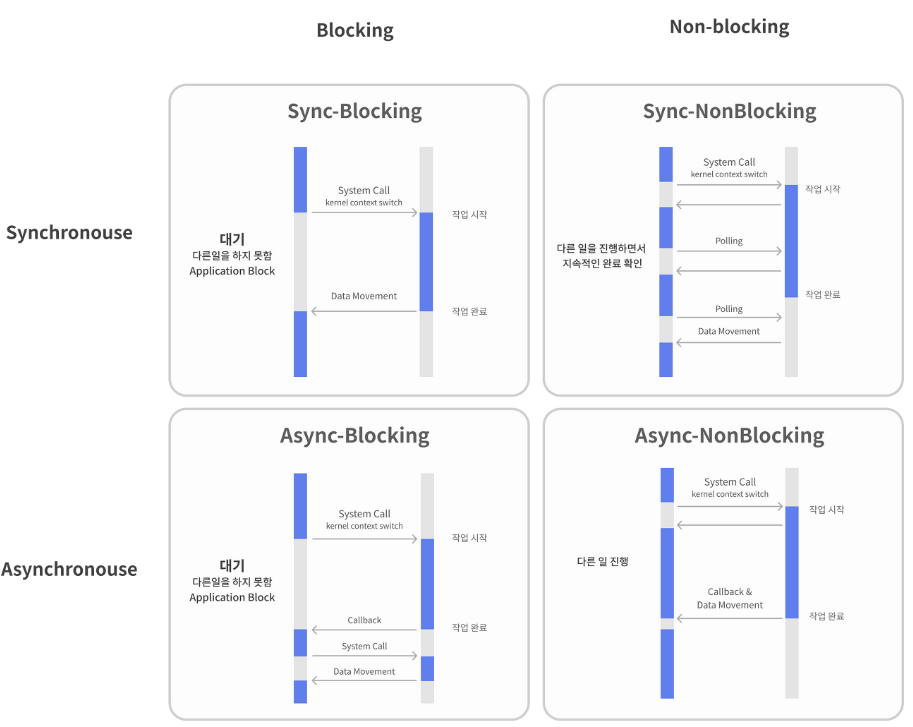

## [참고 - Spring 5 WebClient](https://www.baeldung.com/spring-5-webclient)

# Spring WebClient 개요

<br>

## WebClient?

WebClient는 RestTemplate를 대체하는 HTTP 클라이언트다.

기존의 동기 API를 제공할 뿐만 아니라, Non-Blocking 및 비동기 접근 방식을 지원해서 효율적인 통신이 가능하다.

<br>

WebClient는 요청을 나타내고 전송하게 해주는 빌더 방식의 인터페이스를 사용하며, 외부 API로 요청을 할 때 리액티브 타입의 전송과 수신을 한다. (Mono, Flux)

<br>

WebClient은 아래와 같은 특징을 정리하면 아래와 같다.

- 싱글 스레드 방식을 사용
- Non-Blocking 방식을 사용
- JSON, XML을 쉽게 응답받는다.

<br>

### Non-Blocking

✔ 제어권 반한

|               | Blocking                                                             | Non-Blocking                       |
|---------------|----------------------------------------------------------------------|------------------------------------|
| **설명**      | Application이 kernel로 작업 요청을 할 때, kernel에서는 요청에 대한 로직을 실행한다.          | Application이 요청을 하고 바로 제어권을 받는다.   |
| **동작**      | Application은 요청에 대한 응답을 받을 때까지 대기하며, kernel의 작업 완료를 백그라운드에서 계속 확인한다. | Application은 요청 후 다른 로직을 실행할 수 있다. |
| **유형**      | Blocking I/O                                                         | Non-Blocking I/O                   |

<br>

| 항목           | Sync                                           | Async                                                                    |
|----------------|------------------------------------------------|--------------------------------------------------------------------------|
| **중점**       | 요청과 응답을 직렬적으로 처리                    | 요청을 보낸 후 응답을 기다리지 않고 다른 작업을 수행                     |
| **응답 시점**  | 요청을 보내면 응답을 받을 때까지 기다림           | 요청 후 바로 다음 작업을 수행하며, 응답이 오면 콜백 함수를 통해 처리      |
| **적합한 상황**| 결과의 순서가 중요한 작업, 단순한 작업 순서      | 복잡한 작업 흐름, I/O 바운드 작업, 응답 지연이 예상되는 작업              |

<br>

* Application : 왼쪽
* Kernel : 오른쪽

<br>



<br><br>

| 타입                    | 정의                                                                                                                               | 예시 (Java & Spring Framework 기준)                                                                                                                                                                                                                                                                 |
|-----------------------|----------------------------------------------------------------------------------------------------------------------------------|-------------------------------------------------------------------------------------------------------------------------------------------------------------------------------------------------------------------------------------------------------------------------------------------------|
| **Sync-Blocking**     | 동기 방식에서 블로킹은 요청한 작업이 완료될 때까지 대기한다. <br> 수행한 순서대로 결과가 반환된다.                                                                       | JDBC로 데이터베이스에서 데이터를 조회할 때, 해당 조회가 완료될 때까지 기다리는 경우.                                                                                                                                                                                                                                              |
| **Sync-NonBlocking**  | 동기 방식의 논블로킹은 작업을 시작한 후 완료를 기다리지 않고 바로 다음 작업을 수행한다. <br> 작업 완료를 확인하기 위해 Application의 Process 혹은 Thread가 주기적으로 (Polling) 상태를 확인한다. | UI 업데이트를 위해 `Platform.runLater()`를 사용하는 경우. <br> 사용자가 버튼을 클릭하면 어떤 긴 작업이 시작되어도 UI는 멈춰있지 않고 다른 작업을 계속 수행할 수 있다.                                                                                                                                                                                   |
| **Async-Blocking**    | 비동기적 실행 중에 특정 조건을 만족할 때까지 대기하는 방식이다. <br> 비동기의 주된 장점인 병렬 처리를 제대로 활용하지 못할 때 발생한다.                                                 | Spring의 `@Async` 어노테이션을 사용해 비동기로 실행된 메서드 내에서 결과를 직접 기다리는 경우.                                                                                                                                                                                                                                    |
| **Async-NonBlocking** | 작업과 그 결과 처리가 별도로 수행되며, 각자의 작업을 독립적으로 수행한다. <br> 작업 완료 후에는 콜백 함수나 이벤트를 통해 결과를 처리한다.                                               | Spring WebFlux를 사용하여 리액티브 프로그래밍 방식으로 데이터를 처리하고, 데이터가 준비될 때까지 기다리지 않는 경우. <br> 이를 사용하면, 한 스레드가 I/O 작업을 대기하는 동안 다른 작업을 수행할 수 있다. <br><br> 예를 들어, 데이터베이스에서 데이터를 가져오는 작업을 시작하고, 데이터가 준비될 때까지 다른 요청을 처리할 수 있다. <br> 데이터가 준비되면 콜백 함수나 이벤트를 통해 결과를 처리한다. <br> 이 방식은 높은 동시성 환경에서 서버의 자원을 효율적으로 활용할 수 있게 한다. |

<br>

### Dependencies

Webclient를 사용하려면 의존성을 먼저 추가해야 한다.

```gradle
dependencies {
    compile 'org.springframework.boot:spring-boot-starter-webflux'
}
```

<br><br><br>

## Create

WebClient를 생성하는 방법은 2가지가 있다.

아주 단순하게 create()를 하는 방법과, option을 추가할 수 있는 build()를 사용한 생성이 있다.

<br>

### create()

WebClient의 디폴트 세팅으로 아래와 같이 생성할 수 있으며, 요청할 uri와 함께 생성할 수도 있다.

```java
import org.springframework.web.reactive.function.client.WebClient;

WebClient.create();
// or
WebClient.create("http://localhost:8080");
```

<br>

### builder()

설정을 customization 할 수 있도록 DefaultWebClientBuilder 클래스을 사용하는 build() 메서드를 사용할 수도 있다.

```java
import org.springframework.web.reactive.function.client.WebClient;
import org.springframework.http.HttpHeaders;
import org.springframework.http.MediaType;
import java.util.Collections;

WebClient client = WebClient.builder()
  .baseUrl("http://localhost:8080")
  .defaultCookie("cookieKey", "cookieValue")
  .defaultHeader(HttpHeaders.CONTENT_TYPE, MediaType.APPLICATION_JSON_VALUE) 
  .defaultUriVariables(Collections.singletonMap("url", "http://localhost:8080"))
  .build();
```

<br>

**Options**

- `uriBuilderFactory` : base url을 커스텀 한 UriBuilderFactory


- `defaultHeader` : 모든 요청에 사용할 헤더


- `defaultCookie` : 모든 요청에 사용할 쿠키


- `defaultRequest` : 모든 요청을 커스텀 할 Consumer


- `filter` : 모든 요청에 사용할 클라이언트 필터


- `exchangeStrategies` : HTTP 메시지 reader & writer 커스터마이징


- `clientConnector` : HTTP 클라이언트 라이브러리 세팅

<br><br><br>

## Configuration

<br>

### Timeout

요청에 대한 timeout은 아래와 같이 설정할 수 있다.

Connect Timeout 과 ReadTimeout, WriteTimeout을 모두 5000ms로 지정한 HttpClient 객체를 만들어 주입할 수 있다.

```java
import reactor.netty.http.client.HttpClient;
import io.netty.handler.timeout.ReadTimeoutHandler;
import io.netty.handler.timeout.WriteTimeoutHandler;
import org.springframework.web.reactive.function.client.WebClient;
import org.springframework.http.client.reactive.ReactorClientHttpConnector;

import java.time.Duration;
import java.util.concurrent.TimeUnit;

HttpClient httpClient = HttpClient.create()
  .option(ChannelOption.CONNECT_TIMEOUT_MILLIS, 5000)
  .responseTimeout(Duration.ofMillis(5000))
  .doOnConnected(conn -> 
    conn.addHandlerLast(new ReadTimeoutHandler(5000, TimeUnit.MILLISECONDS))
      .addHandlerLast(new WriteTimeoutHandler(5000, TimeUnit.MILLISECONDS)));

WebClient client = WebClient.builder()
  .clientConnector(new ReactorClientHttpConnector(httpClient))
  .build();
```

<br>

### mutate()

한 번 빌드 한 뒤부터 WebClient는 immutable 하다.
WebClient를 Singleton으로 사용할 때 default setting과 다르게 사용하고 싶을 때에는 mutate()를 사용할 수 있다.

```java
WebClient client1 = WebClient.builder()
        .filter(filterA).filter(filterB).build();

WebClient client2 = client1.mutate()
        .filter(filterC).filter(filterD).build();
```

<br><br><br>

## Request

WebFlux와 함께 나온 만큼 리액터 Mono와 Flux를 메인으로 다룬다.

<br>

### GET

1. Flux
```text
GET /employees
Request: collection of employees as Flux
```

```java
@Autowired
WebClient webClient;

public Flux<Employee> findAll() {
	return webClient.get()
		.uri("/employees")
		.retrieve()
		.bodyToFlux(Employee.class);
}
```

<br>

2. Mono
```text
GET /employees/{id}
Request: single employee by id as Mono
```

```java
@Autowired
WebClient webClient;

public Mono<Employee> findById(Integer id) {
	return webClient.get()
		.uri("/employees/" + id)
		.retrieve()
		.bodyToMono(Employee.class);
}
```

<br>

### POST

```text
POST /employees
Request : creates a new employee from request body
Reponse : returns the created employee
```

```java
@Autowired
WebClient webClient;

public Mono<Employee> create(Employee empl) {
	return webClient.post()
		.uri("/employees")
		.body(Mono.just(empl), Employee.class)
		.retrieve()
		.bodyToMono(Employee.class);
}
```

body를 보면 Mono.just(empl)이 있으며 empl의 타입이 Employee이라는 클래스 정의한다.

여기서 입력값이 Mono<Employee> 타입이라는 것을 확인할 수 있다.

<br>

만약, POST를 하고 받을 body가 없다면 Void.class를 입력하면 된다.

```java
@Autowired
WebClient webClient;

public Mono<Void> create(Employee empl) {
    return webClient.post()
        .uri("/employees")
        .body(Mono.just(empl), Employee.class)
        .retrieve()
        .bodyToMono(Void.class);
}
```

<br><br><br>

## Response

요청을 한 후에는 응답을 받을 때에는 아래의 두 가지 메소드 중 적절한 것을 선택하면 된다.


- retrieve() : body를 받아 디코딩 하는 간단한 메소드

- exchange() : ClientResponse를 상태 값 그리고 헤더와 함께 가져오는 메소드

<br>

exchange()를 통해 세세한 컨트롤이 가능하지만, Response 컨텐츠에 대한 모든 처리를 직접 하면서 메모리 누수 가능성 때문에 retrieve()를 권고하고 있다.

<br>

bodyToFlux, bodyToMono는 가져온 body를 각각 Reactor의 Flux와 Mono 객체로 바꿔준다.

Mono 객체는 0-1 개의 결과를 처리하는 객체이고, Flux는 0-N개의 결과를 처리하는 객체다.

<br>

### retrieve()

retrieve를 사용한 후의 데이터는 크게 두 가지 형태로 받을 수 있다.

<br>

**✔️ toEntity()**

status, headers, body를 포함하는 ResponseEntity 타입으로 받을 수 있다.

```java
 Mono<ResponseEntity<Person>> entityMono = client.get()
     .uri("/persons/1")
     .accept(MediaType.APPLICATION_JSON)
     .retrieve()
     .toEntity(Person.class);
```

<br>

**✔️ toMono() , toFlux()**

body의 데이터로만 받고 싶다면 아래와 같이 사용할 수 있다.

```java
Mono<Person> entityMono = client.get()
    .uri("/persons/1")
    .accept(MediaType.APPLICATION_JSON)
    .retrieve()
    .bodyToMono(Person.class);
```

<br><br>

### exchangeToXXXX()

```java
Mono<Person> entityMono = client.get()
    .uri("/persons/1")
    .accept(MediaType.APPLICATION_JSON)
    .exchangeToMono(response -> {
        if (response.statusCode().equals(HttpStatus.OK)) {
            return response.bodyToMono(Person.class);
        }
        else {
            return response.createException().flatMap(Mono::error);
        }
    });
```

<br><br>

### Mono<>, Flux<> 사용

아래와 같이 Blocking 방식으로 처리하고자 할 때에는 .block(),  Non-Blocking 방식으로 처리하고자 할 때에는 .subscribe() 를 통해 callback 함수를 지정할 수 있다.

```java
// blocking
Mono<Employee> employeeMono = webClient.get(). ...
employeeMono.block()

// non-blocking
Mono<Employee> employeeFlux = webClient.get(). ...
employeeFlux.subscribe(employee -> { ... });
```

<br><br><br>

## ErrorHandling

<br>

### retrieve()

retrieve는 1xx, 2xx, 3xx, ... StatusCode 별로 아래와 같이 처리할 수 있다.

```java
Mono<Person> result = client.get()
        .uri("/persons/{id}", id).accept(MediaType.APPLICATION_JSON)
        .retrieve()
        .onStatus(HttpStatus::is4xxClientError, response -> ...)
        .onStatus(HttpStatus::is5xxServerError, response -> ...)
        .bodyToMono(Person.class);
```

<br>

### exchangeToXXXX()

exchange를 통해 받은 응답에 대한 statusCode를 이용해 분기 처리하여 핸들링할 수 있다.

```java
Mono<Object> entityMono = client.get()
       .uri("/persons/1")
       .accept(MediaType.APPLICATION_JSON)
       .exchangeToMono(response -> {
           if (response.statusCode().equals(HttpStatus.OK)) {
               return response.bodyToMono(Person.class);
           }
           else if (response.statusCode().is4xxClientError()) {
               return response.bodyToMono(ErrorContainer.class);
           }
           else {
               return Mono.error(response.createException());
           }
       });
```

<br><br><br>