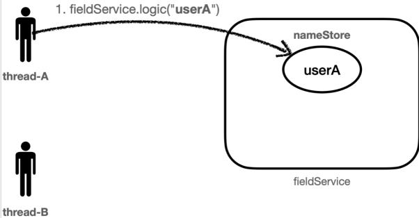
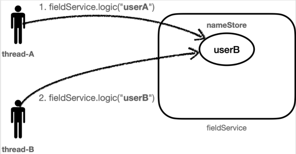
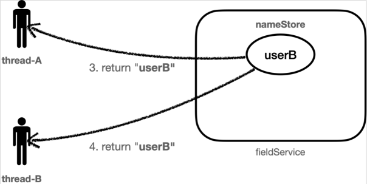
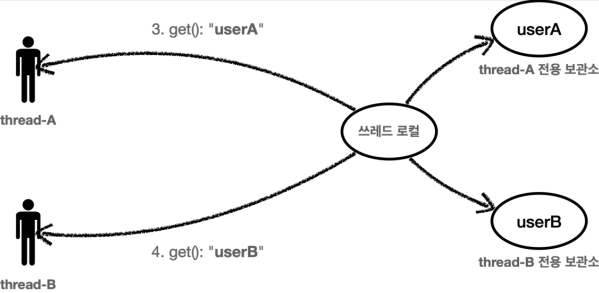
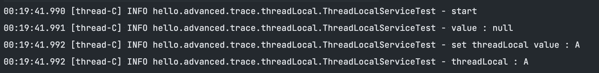
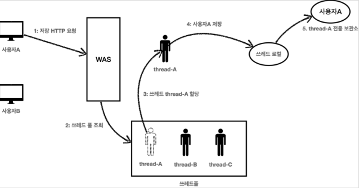
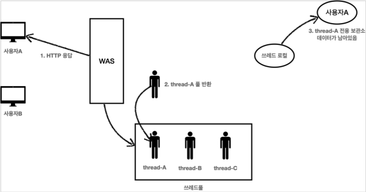
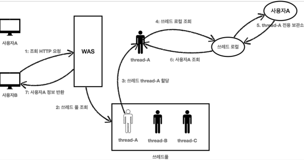

# Thread Local

<br>

## Thread Local 왜 쓸까?

일단 아래의 3개의 이미지를 순차적으로 보자.

<br>







<br><br>

thread-A 의 호출이 끝나면서 nameStore 의 결과를 반환받는데, 이때 nameStore 는 앞의 2번에서
userB 의 값으로 대체되었다.


결과적으로 Thread-A 입장에서는 저장한 데이터와 조회한 데이터가 다른 문제가 발생한다. 이처럼 여러
쓰레드가 동시에 같은 인스턴스의 필드 값을 변경하면서 발생하는 문제를 동시성 문제라 한다.


이런 동시성 문제는 여러 쓰레드가 같은 인스턴스의 필드에 접근해야 하기 때문에 트래픽이 적은 상황에서는 확률상 잘 나타나지 않고, 트래픽이 점점 많아질 수 록 자주 발생한다.

<br>

### ✅ 참고 

이런 동시성 문제는 지역 변수에서는 발생하지 않는다. 지역 변수는 쓰레드마다 각각 다른 메모리 영역이 할당된다.


동시성 문제가 발생하는 곳은 같은 인스턴스의 필드(주로 싱글톤에서 자주 발생), 또는 static 같은 공용 필드에 접근할 때 발생한다. 동시성 문제는 값을 읽기만 하면 발생하지 않는다. 어디선가 값을 변경하기 때문에 발생한다.

<br><br>

## Thread Local

여러개의 스레드가 존재할 때, 해당 스레드만 접근할 수 있는 특별한 저장소를 의미한다. 더 풀어서 이야기 해보자. 만약 서로 다른 두 스레드가 하나의 변수에 접근한다고 할 때, 이 변수는 공유 자원으로 동시성 문제가 발생할 가능성이 다분하다. ThreadLocal 클래스는 오직 한 스레드에 의해 읽고/쓰여질 수 있는 변수를 생성한다.

<br>

가령 Thread A 가 ThreadLocal 변수( tLocal ) 에 접근하여 a 라는 문자를 저장한다고 하자. 동시에 Thread  B 에서 마찬가지로 tLocal 변수에 접근하여, b 라는 문자값을 저장한다고 하면 어떻게 될까? a 라는 문자를 b 가 덮어 버리는 것이 아니라, 아래 처럼 각 스레드별 전용 저장소에 각각의 값이 저장된다. 즉 멀티 스레드 환경에서 공유 자원의 동시성 문제를 해결할 수 있게 되는 것이다.

<br>



<br><br>

## Thread Local Life Cycle

<br><br>

### Thread Local Create

```java
ThreadLocal<String> threadLocal = new ThreadLocal<>();
```

제네릭을 사용하여 타입 지정할 수 있다.

<br><br>

### Thread Local write/read

```java
threadLocal.set("a") // thread local 값 저장
threadLocal.get()    // 저장된 값 불러오기
```

선언된 threadLocal 변수의 set(), get() 메서드를 이용해 Thread Local 값을 쓰고 읽을 수 있다.

아무 값도 저장되지 않은 Thread Local의 값을 읽으면(get()) null 을 반환한다.

<br>

```java
@Slf4j
public class ThreadLocalServiceTest {

    private ThreadLocal<String> threadLocal = new ThreadLocal<>();
    
    @Test
    void field() {

        Runnable userC = () -> {
            log.info("start");

            String value = threadLocal.get();
            log.info("value : {}", value);

            log.info("set threadLocal value : A");
            threadLocal.set("A");

            value = threadLocal.get();
            log.info("threadLocal : {}", value);
        };

        Thread threadC = new Thread(userC);
        threadC.setName("thread-C");
        threadC.start();

    }
}
```



<br><br>

### Thread Local remove

Thread Local을 모두 사용하고 나면 반드시 ThreadLocal.remove() 메서드를 호출하여, Thread Local에 저장된 값을 제거해야 한다.

Thread Local의 값을 제거하지 않으면 어떤 문제가 발생하는지 아래의 이미지를 통해 확인해보자.

<br>





<br>

1. 사용자 A 가 저장 HTTP 요청을 보낸다. 


2. WAS 는 스레드풀에서 스레드를 하나 조회한다.


3. 해당 스레드는 thread-A 가 할당 되었고, 사용자 A 의 데이터를 Thread Local에 저장한다.


4. Thread Local thread-A 전용 보관소에 사용자A 의 데이터를 보관한다.


5. 사용자 A 의 HTTP 요청이 종료되면, thread-A 는 다시 스레드 풀에 반환된다.


6. thread-A 는 스레드 풀을 통해서 재사용 될 수 있다.

<br><br>



1. 사용자 B 에서 HTTP 조회 요청을 보낸다.


2. 스레드 풀에서 하필 thread-A 가 할당되었다.


3. 조회 요청이기 때문에 스레드 풀의 thread-A  전용 공간에서, 이전에 저장해둔 값이 조회된다.


4. 즉 사용자 B 가 예상한 조회 결과가 아닌, 사용자 A 가 저장해둔 값이 조회되는 문제가 발생한다.