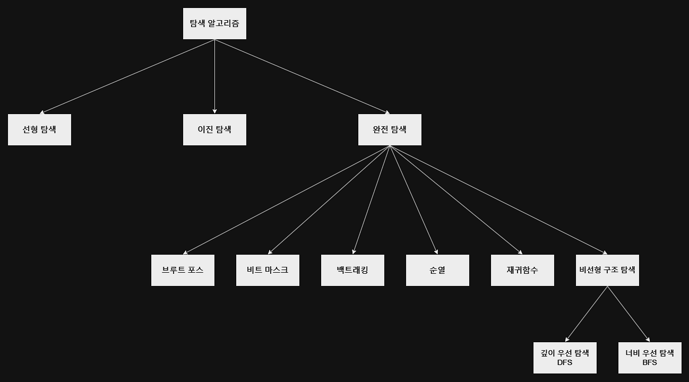
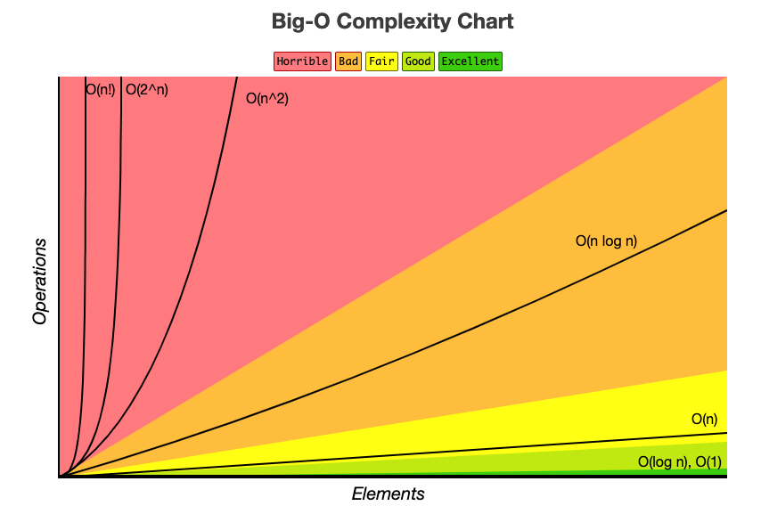

# 완전 탐색(Exhaustive Search) 1️⃣

 

## 💡 완전 탐색(Exhaustive Search)이란?

- 알고리즘에서 사용되는 기법 중 하나로 `모든 가능한 경우의 수를 탐색`하여 `최적의 결과를 찾는 방법`을 의미.

- 모든 가능성을 고려하기 때문에 항상 최적의 해를 찾을 수 있지만, 경우의 수가 매우 많은 경우 시간과 메모리의 부담이 커질 수 있다. 그렇기에 문제의 특성에 따라 다른 탐색 기법을 사용해야 한다.

  

## 💡 완전 탐색(Exhaustive Search) 종류

  

## 💡 알고리즘의 종류 및 특성

| 알고리즘 종류 | 설명                                                                                           | 장점                                     | 단점                                     |
|:--------|:---------------------------------------------------------------------------------------------|:---------------------------------------|:---------------------------------------|
| 브루트 포스  | `모든 경우의 수를 탐색`하면서 원하는 결과를 얻는 알고리즘.                                                           | 가능한 모든 경우를 다 검사하기 때문에 예상된 결과를 얻을 수 있다. | 경우의 수가 많을 경우 시간이 오래 걸린다.               |
| 비트마스크   | `모든 경우의 수`를 이진수료 표현하고 `비트 연산`을 통해 원하는 결과를 빠르게 얻는 알고리즘.                                       | 이진수 연산을 이용하여 계산 속도가 빠르다.               | 경우의 수가 많아질수록 메모리 사용량이 늘어난다.            |
| 백트래킹    | 결과를 얻기 위해 진행하는 도중에 `막히게 되면` 그 지점으로 다시 돌아가서 `다른 경로를 탐색`하는 방식. 결국 모든 가능한 경우의 수를 탐색하여 해결책을 찾는다. | 경우의 수를 줄이면서도 모든 경우를 탐색할 수 있다.          | 재귀 함수를 이용하기 때문에 스택 오버플로우가 발생할 가능성이 있다. |
| 순열      | `순열`을 이용하여 모든 경우의 수를 탐색하는 방법. 순열은 서로 다른 n개 중에서 r개를 선택하여 나열하는 방법.                             | 경우의 수가 적을 때 사용하면 유용하다.                 | 경우의 수가 많을 경우 시간이 오래 걸린다.               |
| 재귀 함수   | 자기 자신을 호출하여 모든 가능한 경우의 수를 체크하면서 최적의 해답을 얻는 방식.                                               | 코드가 간결하다.                              | 스택 오버플로우가 발생할 가능성이 있다.                 |
| DFS     | 깊이 우선 탐색(DFS: Depth-First Search): 루트 노드에서 시작하여 다음 분기로 넘어가기 전에 해당 분기를 완벽하게 탐색하는 방법.          | 미로 찾기 등에 유용하다.                         | 최악의 경우, 모든 노드를 다 방문해야 하므로 시간이 오래 걸린다.  |
| BFS     | 너비 우선 탐색(Breadth-First Search: BFS): 루트 노드에서 시작하여 인접한 노드를 먼저 탐색하는 방법.                 | 레벨 순회에 유용하다.                           | 최악의 경우, 모든 노드를 다 방문해야 하므로 시간이 오래 걸린다.  |

  

## 💡 완전 탐색(Exhaustive Search)의 시간 복잡도

 

💡 빅오 표기법으로 확인하는 시간 복잡도에 따른 효율적인 알고리즘 순서

1. 재귀 함수 (시간 복잡도: O(n))  
2. 브루트 포스 (시간 복잡도: O(nm))  
3. DFS/BFS (시간 복잡도: O(V+E))  
4. 비트 마스크 (시간 복잡도: O(2^n * n))  
5. 순열 (시간 복잡도: O(n!))  
6. 백트래킹 (시간 복잡도: 최악의 경우, O(n!))  

 

⚙ 비트 마스크, 순열, 백트래킹 등의 알고리즘은 경우의 수가 작을 때 매우 효율적일 수 있지만, 경우의 수가 많아질수록 시간 복잡도가 급격히 증가

 

  