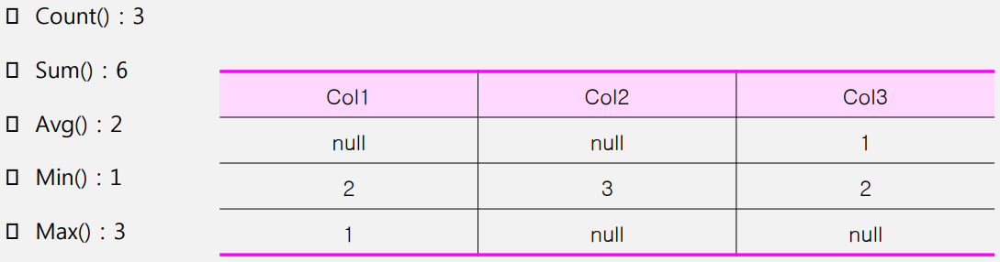

# Deep Dive SQL 이론 #1

<br>

### SQL 연산 순서

* From
* Where
* Group by
* Having
* Select
* Order by

<br>

| DML                            | DDL                         | TCL              | DCL           |
|--------------------------------|-----------------------------|------------------|---------------|
| select, insert, update, delete | alter, create, modify, drop | rollback, commit | grant, revoke |

<br><br>

### Distinct

* 어떤 컬럼 값들의 중복을 제거한 결과를 출력한다.

```sql
select distinct col from table;


select distinct col1, col2 from table;

# 위의 경우엔 col1과 col2의 값이 모두 같지 않은 것만 출력한다.
```

<br><br>

### Alias ★★

* select 절에서 사용 가능, where 절에서는 사용 불가 ❗❗

```sql
select col as name from table; ＝ select col name from table;
```

<br><br>

### concat

```sql
select col1＋col2＋col3 from table; `SQL Server`


select col1 || col2 || col3 from table; `oracle`


select concat(col1, col2) from table;

# 연산자가 2개
```

<br><br>

### 논리연산자

* `NOT`：~가 아니다
* `AND`：A 그리고 B(둘 다 만족)
* `OR`：A 또는 B

<br><br>

### SQL 연산자★

* `A between B and C`：B ＜＝A ＜＝C
* `A in (1,2,3)`：A＝1 or A＝2 or A＝3
* `A like ‘_ble*’`：A의 값 중 2, 3, 4번째 값이 ble인 모든 데이터 출력

<br><br>

### escape

* `and email like ‘@_%’ escape ‘@’`
  * 아무 문자나 가능

<br><br>

### rownum, top

* where 절 옆에 rownum - `oracle`
* select 옆에 top - `SQL server`

<br><br>

### null 정의 ★★★

* 모르는 값, 정의되지 않은 값 (공백이나 0과는 다르다.)
* 산술연산에서 null이 들어가게 되면 null이 출력된다.
* *null＋2, null * 4, null＋null 모두 결과는 null

<br>

* 조건절에 null이 들어가게 되면 false를 반환함.
* *null＝null, null＝2

<br>

* 집계 함수(sum, count, min, max …)에서 null은 데이터 대상에서 제외된다.
* 정렬 시에는 오라클에서는 가장 큰 값이 되고, SQL Server에서는 가장 작은 값이 된다.

<br>

* `Nvl(col,0)`：col이 null이면 0 반환, 아니면 col 반환
* `Nvl2(col,1,0)`：col이 null이면 0 반환, 아니면 1 반환
* `Isnull(col,0)`：col이 null이면 0 반환, 아니면 col 반환
* `Nullif(col,0)`：col이 0이면 null 반환, 아니면 col 반환
* `Coalesce(col1, col2, col3..)`：null 아닌 첫 번째 값 반환

<br><br>

### 정렬 ★★

* 느려질 수 있다.
* 가장 마지막에 실행
* null이 어디에 오는지...

<br>

* 컬럼명으로 정렬, 앞의 기준이 같을 때 그다음 컬럼으로 정렬
* 기본값은 asc(오름차순), desc는 내림차순
* Order by col1, col2 desc

<br>

* 출력 순서(번호)로 정렬, select 절의 출력 순서로 정렬 순서를 지정
* Order by 2, 1 desc

<br><br>

### 숫자 함수

* `Round(222.45, 1)` 소수점 둘째 자리에서 반올림하여 첫째 자리까지 출력
* `Round(225.67, 0)` 소수점 첫째 자리에서 반올림하여 정수만 출력
* －1 파라미터는 1의 자리에서 반올림하여 정수를 출력

<br>

* `Ceil`(oracle)/`ceiling`(SQL Server) **올림 함수**, 파라미터 사용법은 round와 같음.
* `Floor`：버림 함수, 파라미터 사용법은 round와 같음

<br><br>

### 문자 함수 ★

* `lower`, `upper`：소문자로, 대문자로 


* `trim`, `ltrim`, `rtrim`：양쪽 공백 제거 왼쪽, 오른쪽 공백 제거


* `lpad`, `rpad`：특정 자리를 정하고, 왼쪽/오른쪽의 공백을 채워주는 함수
  * Select lpad(‘A’, 5, ‘*’) from dual;
    * `****A`, rpad 면 `A****`

<br>
  
* `Substr`：SELECT SUBSTR(‘korea’, 2, 2) FROM DUAL; or이 출력 


* `Instr`：SELECT INSTR(‘CORPORATE FLOOR’, ‘PO’) AS idx FROM DUAL; 4가 출력

<br><br>

### 날짜 함수 ★

* `To_char`：날짜형 데이터를 문자로 출력 
  * Select to_char(sysdate, ‘YYYY MM DD’) from dual;

<br>

* `To_date`：문자형 데이터를 날짜형으로 출력
  * select to_date(‘2022－09－22‘) from dual;

<br>

* sysdate `oracle`, getdate() `SQL Server`

<br><br>

### 조건문 ★

<br>

#### Decode

```sql
select decode(col1, ’A’, 1, ’B’, 2, 3) from dual;
```

* col이 A 면 1, B 면 2, 아니면 3

<br>

#### Case

```sql
CASE 
   WHEN col = 'A' THEN 1
   WHEN col = 'B' THEN 2
   ELSE 3
END
```

```sql
CASE col
   WHEN 'A' THEN 1
   WHEN 'B' THEN 2
   ELSE 3
END
```

<br><br>

### 집계 함수 ★★

* Count, min, sum, max 등.
* null은 포함되지 않는다.

<br>

(1, null, 2, 3, null)의 데이터를 기준으로 결과는 다음과 같다.



<br><br>

### join ★★

#### Natural join

```text
# 반드시 두 테이블 간의 동일한 이름, 타입을 가진 컬럼이 필요하다.
# 조인에 이용되는 컬럼은 명시하지 않아도 자동으로 조인에 사용된다.
# 동일한 이름을 갖는 컬럼이 있지만 데이터 타입이 다르면 에러가 발생한다.
# 조인하는 테이블 간의 동일 컬럼이 select 절에 기술 되도 테이블 이름을 생략해야 한다.
```

```sql
select department_id 부서, department_name 부서이름, location_id 지역번호, city 도시
from departments
natural join locations
where city＝’Seattle’;
```

<br>

#### Using

```text
# USING 절은 조인에 사용될 컬럼을 지정한다.
# NATURAL 절과 USING 절은 함께 사용할 수 없다.
# 조인에 이용되지 않은 동일 이름을 가진 컬럼은 컬럼명 앞에 테이블명을 기술한다.
# 조인 컬럼은 괄호로 묶어서 기술해야 한다.
```

```sql
select department_id 부서번호, department_name 부서, location_id 지역번호, city 도시
from departments
join locations using (location_id);
```

<br>

#### left outer join

```sql
from table a 
left outer join table b 
on a.col＝b.col 

    
    위와 같은 오라클 sql 문법은

    
from table a, table b
where a.col＝b.col(+)
```

<br>

#### join 순서

* from a,b,c

* a와 b가 join 되고, 그리고 c와 join 된다

<br><br>

### 서브 쿼리 ★★★

* `Select`：스칼라 서브 쿼리


* `From`：인라인 뷰 (메인 쿼리의 컬럼 사용 가능)


* `Where`：중첩 서브 쿼리


* `Group by`：사용 불가


* `Having`：중첩 서브 쿼리


* `Order by`：스칼라 서브 쿼리


* `In`：서브 쿼리 출력값들 or 조건


* `any / some`：서브 쿼리 출력값들 중 가장 작거나 큰 값과 비교


* `All`：any/some과 반대 개념


* `Exists`：서브 쿼리 내 select 절엔 뭐가 와도 상관없다. Row가 있으면 true, 없으면 false

<br><br>

### 집합 연산자 ★★

* `Union`：정렬 O, 중복 제거 O, 느리다.


* `Intersect`：정렬 O, 교집합, 느리다.


* `Minus(except)`：정렬 O, 차집합, 느리다.


* `Union all`：정렬 X, 중복 제거 X, 빠르다.

<br><br>

### DDL ★★

* `truncate` － drop & create, 테이블 내부 구조는 남아있으나 데이터가 모두 삭제됨.


* `drop` － 테이블 자체가 없어짐. (당연히 데이터도 없음), 롤백 할 수 없다.


* `delete` － 데이터만 삭제, `COMMIT`을 실행하기 전에는 `ROLLBACK`을 통해 삭제된 데이터를 복구할 수 있다.


* `rollback, commit`과 항상 같이 나옴.

<br><br>

### DML ★

* Insert：데이터 넣는 명령

```sql
insert into 테이블(col1, col2, col3..) values (‘11’, ‘22’, ‘33’..);

# values를 기준으로 좌우의 괄호 속 개수가 맞는지
```

<br>

* update：데이터의 특정 행 값을 변경 (delete & insert)

```sql
update 테이블 
set col＝‘값’
where col1＝‘조건’;
```

<br>

* delete：데이터의 특정 행을 삭제

```sql
delete from 테이블 
where col＝‘조건’;
```

<br>

* merge：특정 데이터를 넣을 때 해당 테이블 키값을 기준으로 있으면 update, 없으면 insert를 한다.

<br><br>

### 제약조건 ★★★

* K：not null＋unique
  * 테이블당 하나의 PK를 가질 수 있음 (하나라는게 컬럼이 아님, 복합키 가능)


* Not null：해당 컬럼에 null이 올 수 없음


* Unique：해당 컬럼에 중복값이 올 수 없음

<br><br>

### DCL

* Grant, Revoke 문법

```sql
-- 특정 사용자에게 테이블에 대한 SELECT 권한 부여
GRANT SELECT ON table_name TO user_name;

-- 특정 사용자에게 테이블에 대한 여러 권한(예: SELECT, INSERT, UPDATE) 부여
GRANT SELECT, INSERT, UPDATE ON table_name TO user_name;

-- 특정 사용자에게 데이터베이스의 모든 권한 부여
GRANT ALL PRIVILEGES ON database_name.* TO user_name;

```

<br>

```sql
-- 특정 사용자로부터 테이블에 대한 SELECT 권한 박탈
REVOKE SELECT ON table_name FROM user_name;

-- 특정 사용자로부터 테이블에 대한 여러 권한(예: SELECT, INSERT, UPDATE) 박탈
REVOKE SELECT, INSERT, UPDATE ON table_name FROM user_name;

-- 특정 사용자로부터 데이터베이스의 모든 권한 박탈
REVOKE ALL PRIVILEGES ON database_name.* FROM user_name;

```

<br><br>

### VIEW

* 독립성, 편의성, 보안성
* SQL을 저장하는 개념

<br><br>