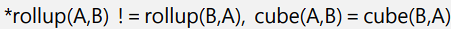
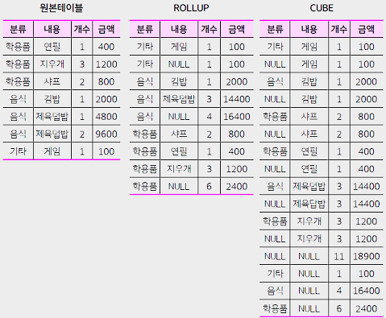
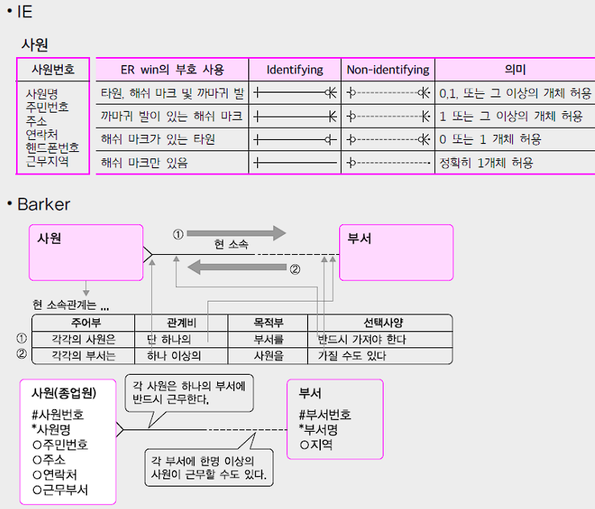

# Deep Dive SQL 이론 #2

<br>

### 그룹함수

* `roll up`
* `cube`
* `groupingsets `
* `grouping`

<br>

* 어떤 결과가 나오고, 어떤 함수를 사용했는지에 대한 문제 기출
  
<br><br>

### ROLLUP

* ROLLUP은 지정된 컬럼의 계층적 그룹을 생성.
* 컬럼들은 왼쪽에서 오른쪽 순서대로 서브 토탈을 생성.


* 만약 컬럼 A, B로 ROLLUP을 사용하면 다음과 같은 결과 집합을 얻을 수 있다.
  * A, B 그룹화된 결과
  * A로만 그룹화된 결과 (B에 대한 서브 토탈)
  * 전체 총계

<br><br>

### CUBE

* CUBE는 모든 가능한 조합의 그룹을 생성.


* 컬럼 A, B로 CUBE를 사용하면 다음과 같은 결과 집합을 얻을 수 있다.
  * A, B 그룹화된 결과
  * A로만 그룹화된 결과
  * B로만 그룹화된 결과
  * 전체 총계

<br><br>



<br><br>



<br><br>

### TCL

* `commit`, `rollback`

<br>

#### auto commit

* 이 모드가 활성화되면, 각각의 SQL 명령이 개별적인 트랜잭션으로 취급되어 바로 commit.

<br>

#### begin transaction (또는 start transaction)

* 명시적으로 트랜잭션을 시작. 
* 이후 SQL 명령들은 commit 또는 rollback이 실행될 때까지 확정되지 않는다.

<br><br>

### 윈도우 함수 (Window Function)

* 행과 행 간의 관계를 정의하기 위해 제공되는 함수

<br>

#### ROWS vs RANGE

`ROWS BETWEEN`: 명시적인 행 번호를 기준으로 범위 정의.

`RANGE BETWEEN`: 특정 값의 범위를 기준.

<br>

#### 특정 행을 지정하는 방법:

`UNBOUNDED PRECEDING`: 파티션(Partition)의 첫 행부터 시작.

`CURRENT ROW`: 현재 처리 중인 행을 기준.

`UNBOUNDED FOLLOWING`: 파티션의 마지막 행까지 계속.

<br>

#### 순위 관련 함수:

`RANK()`: 동일한 값에 동일한 순위를 할당하며, 다음 값은 중복된 순위만큼 건너뛴 순위를 얻는다.  (예: 1, 1, 3, 4, …)

`DENSE_RANK()`: 동일한 값에 동일한 순위를 할당하지만, 중복되는 순위를 건너뛰지 않는다. (예: 1, 1, 2, 3, …)

`ROW_NUMBER()`: 파티션 내에서 각 행에 고유한 숫자를 할당.

<br>

#### 파티션 및 정렬:

`PARTITION BY`: 결과를 여러 그룹으로 나눕니다. 각 그룹은 별도의 "윈도우" 또는 "프레임"으로 취급.

`ORDER BY`: 윈도우 내에서 행을 어떻게 정렬할지 지정.

<br>

```sql
ROW_NUMBER() OVER (PARTITION BY col1 ORDER BY col2)
```

위의 함수는 col1을 기준으로 데이터를 파티션하고, <br>
각 파티션 내에서는 col2를 기준으로 행을 정렬하며, <br>
각 행에 순차적인 번호를 할당.

<br><br>

### OVER

* OVER 절은 윈도우 함수가 어떤 행들에 대하여, 어떻게 연산을 수행할지를 지정하는 데 사용되는 구문.

<br><br>

#### 파티션 지정

* `PARTITION BY 절`을 사용하여 데이터를 여러 그룹으로 분할할 수 있다.

```sql
SUM(salary) OVER (PARTITION BY department_id)
```

`SUM 함수`는 각 department_id 그룹별로 총 급여를 계산.

<br><br>

#### 정렬

* `ORDER BY 절`을 사용하여 윈도우 내의 행들을 특정한 순서로 정렬할 수 있다.

```sql
ROW_NUMBER() OVER (PARTITION BY department_id ORDER BY salary DESC)
```

`ROW_NUMBER() 함수`는 각 부서별로 급여가 높은 순서대로 행에 순차적인 번호를 할당.

<br><br>

#### 프레임 지정

* ROWS 또는 RANGE 절을 사용하여 특정 범위의 행들에 대해 연산을 수행할 범위를 지정할 수 있다.

```sql
AVG(salary) OVER (ORDER BY hire_date ROWS BETWEEN 1 PRECEDING AND 1 FOLLOWING)
```

```sql
ROWS BETWEEN 1 PRECEDING AND 1 FOLLOWING

# 현재 행을 기준으로 바로 전 행(1 PRECEDING)에서 바로 다음 행(1 FOLLOWING)까지의 범위를 지정
```

<br><br><br>

### 계층형 함수 ★

* 계층형 쿼리는 트리 구조와 같은 계층 구조를 갖는 데이터를 조회하기 위한 SQL 문법.
* 주로 조직의 상하관계, 카테고리 구조 등을 나타낼 때 유용하게 사용.

<br>

`CONNECT BY`, `PRIOR`, `START WITH`, 그리고 `LEVEL`은 계층형 쿼리를 작성할 때 주로 사용되는 키워드.

<br><br>

#### `START WITH`

* 계층의 시작 포인트를 지정. 
* 예를 들어 조직에서 최상위 관리자나 특정 카테고리에서 시작하는 경우에 사용.

<br>

#### `CONNECT BY`

* 부모 노드와 자식 노드 간의 관계를 정의. 
* `PRIOR`는 이 관계에서 이전 레벨을 참조.

<br>

#### `PRIOR`

* `CONNECT BY 절`에서 사용되어 부모와 자식 간의 관계를 지정할 때 사용.

<br>

#### `LEVEL`

* 계층의 깊이 또는 레벨을 나타낸다. 
* 예를 들어 최상위 노드에서 시작하면 `LEVEL`은 1이 되고, 그 하위 노드에서는 `LEVEL`은 2가 된다.

<br>

#### `LPAD`

* 문자열 왼쪽에 지정된 문자로 패딩을 추가하는 함수.
* 계층의 깊이를 시각화하기 위해 사용.

<br>

#### `CONNECT_BY_ISLEAF`

* 현재 행이 잎 노드(자식이 없는 노드)인지 아닌지를 나타내는 값을 반환. 
* 1이면 잎 노드, 0이면 잎 노드가 아니다.

<br><br>

#### 예시

관리자가 없는 사원(즉, 최상위 노드)에서 시작하여 해당 사원의 아래 계층을 조회.

```sql
SELECT 
    LEVEL,
    LPAD(' ', 4 * (LEVEL - 1)) || 사원 AS 사원,
    관리자,
    CONNECT_BY_ISLEAF AS ISLEAF
FROM 사원
START WITH 관리자 IS NULL
CONNECT BY PRIOR 사원 = 관리자;
```

<br>

'D'라는 ID를 갖는 사원에서 시작하여 그 사원의 상위 계층을 조회

```sql
SELECT 
    LEVEL,
    LPAD(' ', 4 * (LEVEL - 1)) || 사원 AS 사원,
    관리자,
    CONNECT_BY_ISLEAF AS ISLEAF
FROM 사원
START WITH 사원 = 'D'
CONNECT BY PRIOR 관리자 = 사원;
```

<br><br>

### PL/SQL

* `PL/SQL`은 `Oracle`에서 사용되는 프로시저형 SQL

<br>

`exception`: 오류 핸들링을 위한 절. 오류가 발생할 경우, 해당 절에 정의된 로직을 실행.

`procedure`: 특정 작업을 수행하는 코드 블록. 반환 값이 없다.

`trigger`: 특정 조건 또는 이벤트가 발생할 때 자동으로 실행되는 코드. 예를 들어, 데이터가 테이블에 삽입되거나 수정될 때 실행될 수 있다.

`Before/After`: 트리거가 발생하기 전 또는 후에 실행.

`Insert, Update, Delete`: 해당 연산과 관련된 트리거.

`function`: 반환 값이 있는 코드 블록, 주로 특정 값을 반환하는 데 사용.

<br><br>

### 엔터티 ★★

* `엔터티`: 데이터베이스에서 정보를 저장하는 기본 단위.


* `인스턴스`: 특정 엔터티의 실제 데이터를 나타내는 개별적인 항목.


* `관계`: 엔터티간의 연결 또는 연관을 나타냄.

<br>

#### `유형엔터티 / 개념엔터티 / 사건엔터티`

* `유형엔터티`: 물리적인 객체를 나타냅니다. 예: 차, 빌딩.


* `개념엔터티`: 물리적으로 존재하지 않지만 비즈니스 관점에서 중요한 개념을 나타냅니다. 예: 계약, 보험정책.


* `사건엔터티`: 특정 사건이나 사고를 나타냅니다. 예: 주문, 거래.

<br>

#### `기본엔터티 / 중심엔터티 / 행위엔터티`

* `기본엔터티`: 주요 비즈니스 활동에 중점을 둔 엔터티.


* `중심엔터티`: 여러 엔터티간의 관계에서 중심적인 역할을 하는 엔터티.


* `행위엔터티`: 두 개 이상의 엔터티간의 관계나 행동을 나타내는 엔터티.

<br><br>

### 속성 (Attribute)

* 속성은 데이터베이스의 엔터티나 관계에서 정보를 나타내는 항목. 
* 엔터티의 특징을 나타내며, 다양한 유형이 있다.

<br>

#### `기본 속성`

엔터티에 원래 포함되어 있는 정보를 나타내는 속성. 이는 엔터티의 가장 기본적이고 중요한 특성을 나타낸다. 예: 학생의 이름, 직원의 주민등록번호.

<br>

#### `설계 속성`

엔터티의 정보를 더 효과적으로 관리하거나 사용하기 위해 인위적으로 도입된 속성. 예: 고객 ID와 같이 시스템에서 자동 생성되는 식별 번호.

<br>

#### `파생 속성`

다른 속성의 값에서 계산되거나 유도된 속성. 파생 속성은 다른 속성 값에 의존적이므로, 보통 데이터베이스에 저장되지 않고 필요할 때마다 계산. 예: 나이는 생년월일에서 파생될 수 있습니다.

<br><br>

### 도메인 (Domain)

* 도메인은 속성이 가질 수 있는 가능한 값의 집합을 정의. 
* 속성의 데이터 타입, 크기 및 허용되는 값 등의 제약 조건을 결정.

<br>

#### `데이터 유형`

도메인에 속하는 값의 유형을 나타낸다. 예: 문자열, 정수, 실수, 날짜 등.

<br>

#### `크기`

데이터의 최대 길이나 범위를 나타낸다. 예: 문자열의 최대 길이, 숫자의 최대값 및 최소값.

<br>

### `제약조건`

* 도메인에 속하는 값이 충족해야 하는 조건.

<br>

| 제약조건 | 해설  |
|------|-----|
|`Check`|값이 특정 조건을 만족하는지 확인.|
|`Primary Key`|속성의 값이 유일해야 하며, NULL 값을 허용하지 않는다.|
|`Foreign Key`|속성의 값이 다른 테이블의 기본 키값 중 하나와 일치해야 한다.|
|`Not Null`|속성의 값이 NULL이 아니어야 한다.|
|`Unique`|속성의 값이 유일해야 한다.|

<br><br>

### 관계



<br><br>

### 식별자 ★★

* `유일성`：유일하게 인스턴스를 구분
* `최소성`：최소 컬럼으로
* `불변성`：값이 바뀌지 않아야 함
* `존재성`：not null


* 위 4개를 만족하면 후보키가 될 수 있으며, 그 중 하나, 대표하는 것이 `기본키`.

<br><br>

### 식별자 & 비식별자 ★

#### 식별자 (Identifying Relationship)

| 용어                          | 설명                                                                       |
|-----------------------------|--------------------------------------------------------------------------|
| 강한 관계 (Strong Relationship) | 부모 엔터티의 기본 키(PK)가 자식 엔터티로 전파되어, <br> 자식 엔터티의 일부 혹은 전체로써 주요 키의 일부가 되는 관계. |
| PK의 증가                      | 식별 관계에서는 자식 엔터티가 부모 엔터티의 PK를 포함하기 때문에, <br> 자식 엔터티의 PK는 더 많은 컬럼을 포함.     |
| 조인 복잡성                      | 여러 엔터티가 연결될 때 SQL 쿼리에서 많은 조인을 필요로 할 수 있고, <br> 이로 인해 SQL의 복잡성이 증가할 수 있다. |

<br><br>

#### 비식별자 (Non-Identifying Relationship)

|용어| 설명                                                                         |
|---|----------------------------------------------------------------------------|
| 약한 관계 (Weak Relationship) | 부모 엔터티의 기본 키가 자식 엔터티에 외래 키(FK)로 전파되지만, <br> 자식 엔터티의 주요 키의 일부로는 사용되지 않는 관계. |
| 성능 저하 | 비식별 관계에서는 여러 엔터티를 연결하는데 필요한 조인의 수가 증가하여, <br> 데이터베이스 성능에 영향을 줄 수 있다.       |

<br><br>

### ERD - 그리는 방법

* 좌상에서 우하로
* 관계명은 반드시 표기하지 않아도 됨
* UML은 객체지향에서만 쓰인다.

<br><br>