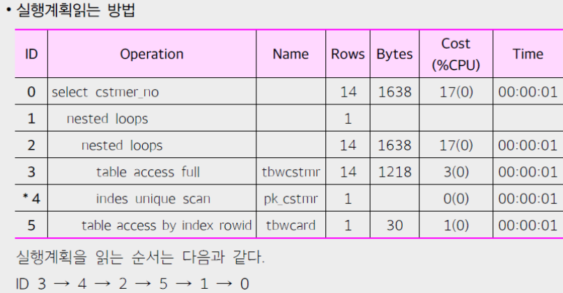
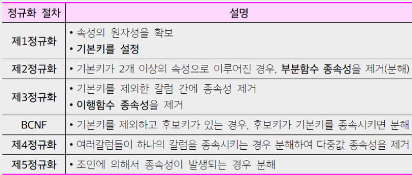
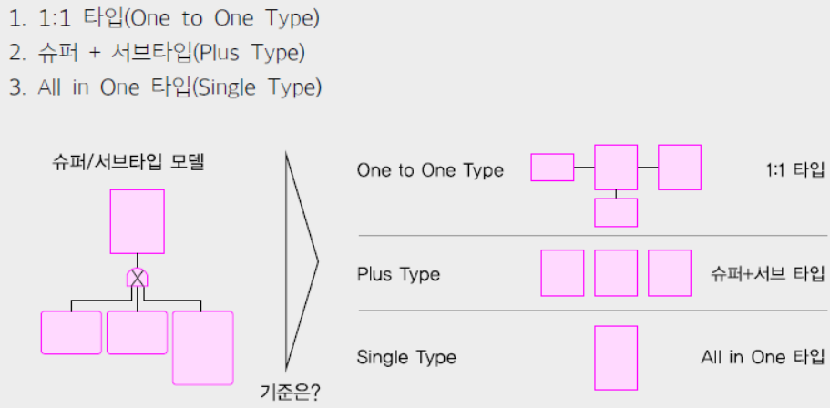
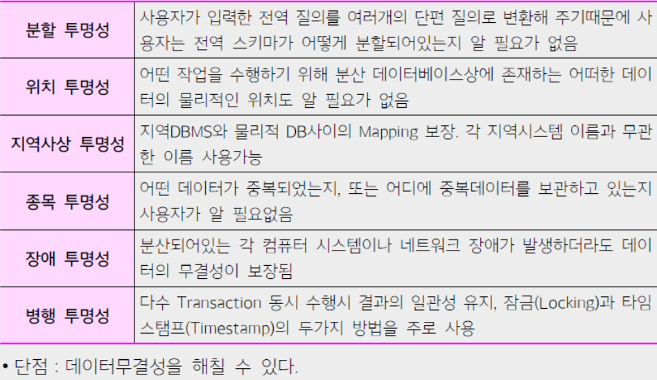

# Deep Dive SQL 이론 #3

 

### 성능 데이터 모델링 ★

 

#### 아키텍쳐 모델링

* 데이터 모델링 과정에서 데이터의 구조와 관계를 정의. 
* 아키텍처 모델링은 시스템의 전반적인 구조와 데이터 플로우를 중점적으로 다룬다.

* `정규화`: 데이터의 중복을 최소화하고 데이터의 무결성을 유지하기 위해 데이터를 구조화하는 과정.
* `반정규화`: 성능 향상을 위해 일부러 데이터의 중복을 허용하는 과정.

 

#### SQL 튜닝

* 데이터베이스의 성능을 최적화하기 위해 SQL 쿼리를 수정하는 과정. 
  * 이는 쿼리의 실행 속도를 높이거나 시스템 리소스 사용을 줄이는 데 중점을 둔다.

* `Join 수행 원리`: 두 개 이상의 테이블에서 데이터를 결합하는 방식에 대한 원리.

 

#### Hash Join

* Hash Join은 주로 중간 크기의 테이블 간의 Join에 유리.

* `등가 Join`: 두 테이블에서 같은 값을 가진 레코드를 결합하는 Join 방식.
* `선행 테이블`: Hash Join에서 먼저 스캔 되는 테이블.

 

#### NL (Nested Loop) Join

* 대용량 sort 작업.
* 선행 테이블이 작을수록 유리.

* `랜덤 액세스`: 데이터베이스의 레코드에 무작위로 접근하는 것.

 

#### Sort Merge Join

* 두 테이블의 `Join Key`를 먼저 정렬한 후 `Join`을 수행하는 방식.

 

#### Optimizer

* 데이터베이스에서 쿼리를 어떻게 실행할지 결정하는 컴포넌트.

* `CBO (Cost-Based Optimizer)`: 쿼리의 실행 계획을 결정할 때 예상 비용을 기반으로 최적의 실행 계획을 선택.
* `RBO (Rule-Based Optimizer)`: 미리 정의된 규칙 세트를 기반으로 쿼리의 실행 계획을 결정.

  

  

### 정규화 ★★★

 

 

* Select 시 join 때문에 느려질 수 있다. (테이블이 늘어나서)
* Insert, update는 빨라질 수 있다. (테이블 사이즈가 작아져서)

  

### 이상 현상

* `삽입 이상(insertion anomaly)`：새 데이터를 삽입하기 위해서 불필요한 데이터도 함께 삽입해야 하는 이상 문제

* `갱신 이상(update anomaly)`：중복튜플 중 일부만 변경하여 데이터가 불일치하게 되는 이상 문제

* `삭제 이상(delete anomaly)`：튜플을 삭제하면 필요한 데이터까지 함께 삭제되는 이상 문제

  

### 반 정규화 ★★

* 반 정규화는 데이터의 무결성을 해칠 수 있으므로 주의가 필요하다.

 

#### 절차

* 1. 대량 범위 처리 빈도수 조사
* 2. 범위 처리 빈도수
* 3. 통계처리 여부

 

| 종류                             | 설명                        |
|--------------------------------|---------------------------|
| `테이블 병합 1:1/1:M`               | 두 개의 테이블을 하나로 합치는 방식      |
| `슈퍼/서브타입 병합`                   | 슈퍼 타입과 서브타입의 테이블을 합치는 방식  |
| `부분 테이블 분할`                    | 하나의 테이블을 여러 부분 테이블로 분리    |
| `통계 테이블 분할`                    | 통계 정보를 담은 테이블을 분할         |
| `중복 테이블 분할`                    | 중복된 정보를 갖는 테이블을 분할        |
| `이력 컬럼 추가`                     | 데이터 변경 이력을 추적하기 위한 컬럼 추가  |
| `중복 컬럼 추가`                     | 성능 향상을 위한 중복 컬럼 추가        |
| `PK를 일반 컬럼으로 병합`               | Primary Key를 일반 컬럼으로 변경   |
| `파생 컬럼 추가`                     | 다른 컬럼에서 파생된 값을 저장하는 컬럼 추가 |
| `응용시스템 오작동을 피하기 위한 임시 값 컬럼 추가` | 임시값을 저장하는 컬럼 추가           |
| `중복 관계 추가`                     | 중복된 관계를 테이블에 추가           

  

### 데이터에 따른 성능

 

#### Row Migration (행 이전)

| 항목 | 설명 |
| --- | --- |
| **정의** | Update로 인해 행 길이가 증가했을 때 발생하는 현상. |
| **원리** | 원래 정보를 기존 블록에 남겨두고 실제 데이터는 다른 블록에 저장. 이로 인해 성능 감소 발생. |
| **해결책** | PCTFREE 영역을 충분히 할당. 단, 너무 크게 설정하면 공간 효율성이 감소될 수 있음. |

 

#### Chaining (행 연결)

| 항목 | 설명 |
| --- | --- |
| **정의** | 데이터 크기 때문에 여러 블록에 나누어 저장되는 현상. |
| **원리** | 2개 이상의 데이터 블록을 검색해야 함. 행조각 및 Row Pointer로 블록 내에 저장. |
| **해결책** | DB_BLOCK_SIZE를 크게 설정하여 최소화 가능. 단, 크게 설정하기 어렵거나 항상 바람직하지 않을 수 있음. |

 

#### Partitioning

| **Partition Type** | **기준**   | **특징** |
|--------------------|----------| --- |
| `List partition`   | 특정 값     | 관리가 쉬우나 데이터가 한쪽으로 치우칠 수 있음. |
| `Range partition`  | 특정 값의 범위 | 관리가 쉬우며 가장 널리 사용됨. |
| `Hash partition`   | 데이터의 분산  | 관리가 상대적으로 어려움. |

  

### 슈퍼/서브타입

 

  

* 트랜잭션은 항상 일괄로 처리하는데 테이블은 개별로 유지되어 Union 연산에 의해 성능이 저하될 수 있다.

* 트랜잭션은 항상 서브타입 개별로 처리하는데 테이블은 하나로 통합되어 있어 불필요하게 많은 양의 데이터 때문에
성능이 저하된다.

* 트랜잭션은 항상 슈퍼＋서브타입을 공통으로 처리하는데 개별로 유지되어 있거나 하나의 테이블로 집약되어 있어 성
능이 저하된다.

  

### 분산 데이터베이스

  

### 인덱스 (Index)

 

#### 인덱스 사용이 불가능한 경우

| **상황**     | **설명**                                                     |
|------------|------------------------------------------------------------|
| `부정형 연산자`  | 인덱스의 값과 일치하지 않는 경우 검색하는 연산자 (예: `!=`, `<>` 등)              |
| `LIKE`     | `LIKE` 사용 시, 와일드카드가 앞에 위치하면 인덱스가 사용되지 않음 (예: `%something`) |
| `묵시적 형 변환` | 다른 데이터 타입으로 암묵적으로 형 변환이 발생하는 경우                            |

 

#### 인덱스의 부작용

| **문제** | **설명** |
| --- | --- |
| `DML 성능 저하` | 인덱스가 있을 경우, `INSERT`, `UPDATE`, `DELETE` 연산이 느려질 수 있음 |
