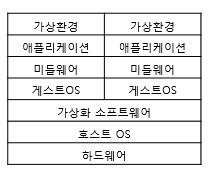
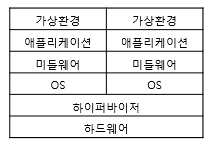
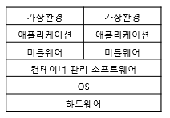

# 가상화 이해하기 #1

 

가상화는 컴퓨터 자원을 분할하여 여러 운영체제를 동시에 실행할 수 있도록 하는 기술.  
주로 세 가지 유형의 가상화가 사용된다.

 

## 호스트 가상화

호스트 가상화는 Base가 되는 Host OS 위에 Guest OS가 구동되는 방식.  

종류로는 VM Workstation, VMware Server 등.  

장점 : 호스트 운영체제에 크게 제약을 받지 않는다.  
단점 : 다른 운영체제를 위한 자원이 필요하기 때문에 성능 저하가 발생할 수 있다.  

  

## 하이퍼바이저 가상화

하이퍼 가상화는 Host OS 없이 하드웨어에 하이퍼바이저를 설치하여 사용하는 방식.  

종류로는 Xen, MS hyper-V, citrix, KVM 등이 있다.  

장점 : 별도의 Host OS가 없기 때문에 자원 사용이 효율적  
단점 : 관리를 위한 별도의 컴퓨터나 콘솔이 필요하다.  

 

### 전 가상화 (Full-Virtualization)

전 가상화는 하드웨어를 완전히 가상화하는 방식으로 Hardware Virtual Machine이라고도 불린다.

 

쉽게 말해 하이퍼바이저는 가상화된 OS가 뭐든지 간에 각 OS들이 내리는 명령어를 알아들을 수 있다.  
예를 들어 윈도우에서 Add, 리눅스에서 ADD, 맥에서 add 라는 명령어를 내렸을때 하이퍼바이저가 “더해라”라고 번역하여 명령어를 실행.  
하이퍼바이저는 이러한 번역 역할뿐만 아니라 가상화된 OS들에게 자원을 할당해 주는 역할도 담당.  

 

장점 : 하드웨어를 완전히 가상화하기 때문에 Guest OS 운영체제의 별다른 수정이 필요 없음  
단점 : 하이퍼바이저가 모든 명령을 중재하기 때문에 성능이 비교적 느림  

 

### 반가상화 (Para-Virtualization)

반가상화는 전 가상화와 달리 하드웨어를 완전히 가상화하지 않는다.

전 가상화의 가장 큰 단점인 성능 저하의 문제를 해결하기 위해,  
하이퍼콜(Hyper Call)이라는 인터페이스를 통해 하이퍼바이저에게 직접 요청을 날릴 수 있다.  
쉽게 말하면 가상화된 각 OS들이 각각 다른 번역기를 갖고 있는 것입니다.  
그 번역기는 각각 다른 OS에서 내리는 각각 다른 명령어를 “더해라”라고 번역해 주게 되는 것.  

장점 : 모든 명령을 DOM0를 통해 하이퍼바이저에게 요청하는 전 가상화에 비해 성능이 빠름  
단점 : 하이퍼바이저에게 Hyper Call 요청을 할 수 있도록 각 OS의 커널을 수정해야 하며 오픈소스 OS가 아니면 반가상화를 이용하기가 쉽지 않음  

  

## 컨테이너 가상화

호스트 운영체제에서 컨테이너 관리 소프트웨어를 사용하여 독립적인 작업 환경(컨테이너)을 생성.  

각 컨테이너는 필요한 라이브러리와 애플리케이션을 갖추고 있어 개별 서버처럼 사용될 수 있다.  

장점 : 컨테이너 가상화는 오버헤드가 적어 가볍고 빠른 장점이 있다.  

 

* 오버헤드
    * 오버헤드는 어떤 처리를 하기 위해 들어가는 간접적인 처리 시간 · 메모리 등을 말한다.

   

### VRA (vRealize Automation)

VMware의 클라우드 관리 플랫폼, 사용자들이 IT 서비스를 자동화하고 제공하는 데 도움.  

 

### VRO (vRealize Orchestrator)

VMware에서 제공하는 IT 프로세스 자동화 도구, 복잡한 IT 작업을 자동화하여 효율성과 일관성을 향상.  

 

### VRLI (vRealize Log Insight)

VMware의 로그 관리 및 분석 솔루션, 실시간 로그 관리, 로그 분석, 로그 검색 등의 기능을 제공.  

 

### VROPS (vRealize Operations)

VMware의 IT 운영 관리 솔루션, IT 환경의 성능 최적화, 용량 계획, 문제 해결 등을 지원.  

 

### VRNI (vRealize Network Insight)

VMware의 네트워크 및 보안 분석 도구, 가시성, 네트워크 트래픽 분석, 보안 관리 등을 제공.  

