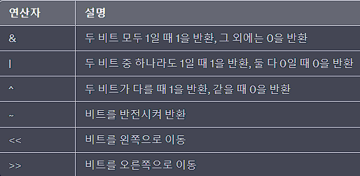
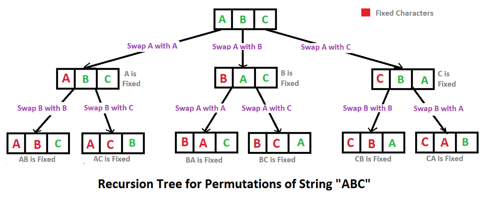
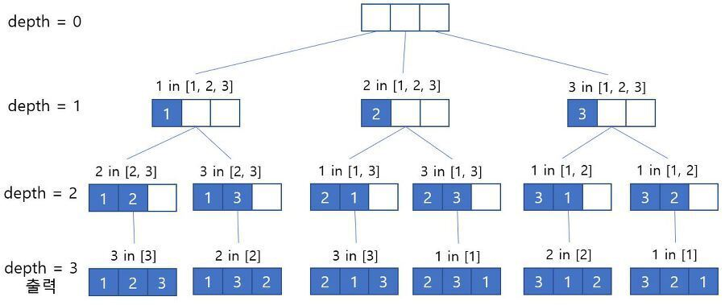
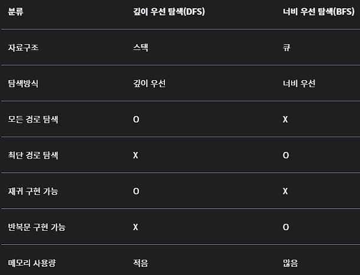

# 완전탐색(Exhaustive Search) 2️⃣

<br>

## 🧐 브루트 포스(Brute-Force)

- `모든 경우의 수를 탐색`하여 최적의 결과를 찾아가는 알고리즘.


- 해당 알고리즘은 경우의 수가 작을 때 사용하는 것이 일반적이다.


- 대표적 예시로 자물쇠의 비밀번호를 알 수 없는 경우, 모든 경우를 대입하여 비밀번호를 찾는 경우가 있다.

<br><br>

### 브루트 포스(Brute-Force) 사용 예시

<br>

### 1️⃣ 배열 탐색

```text
💡 배열에서 특정 값을 찾는 문제에서 브루트 포스 알고리즘은,

   배열을 모두 탐색하여 값을 찾는 방식으로 문제를 해결한다.
```

```java
public int findIndex(int[] arr, int target) {
    for (int i = 0; i < arr.length; i++) {
        if (arr[i] == target) {
            return i;
        }
    }
    return -1;
}
```

<br><br>

### 2️⃣ 문자열 비교

```text
💡 문자열 사전 순 비교 문제에서 브루트 포스 알고리즘은,
   
   가능한 모든 문자열 쌍을 비교하여 최소값 또는 최대값을 찾는 방식으로 문제를 해결한다.
```

```java
public int stringCompare(String s1, String s2) {
        int n1 = s1.length(), n2 = s2.length();
        int min = Math.min(n1, n2);

        for (int i = 0; i < min; i++) {
            if (s1.charAt(i) != s2.charAt(i)) {
                return s1.charAt(i) - s2.charAt(i);
            }
        }

        if (n1 == n2) {
            return 0;
        } else if (n1 > n2) {
            return s1.charAt(min);
        } else {
            return s2.charAt(min);
        }
}
```

<br><br><br>

## 🧐 비트마스크(Bitmask)

- `이진수`를 `비트 연산`을 통해 경우의 수를 줄여가며 탐색하는 방식.


- 비트 마스크를 사용하면 하나의 변수에 여러 개의 상태 정보를 저장할 수 있으며, 이를 통해 복잡한 조건문을 간단하게 처리할 수 있다. 


- 이 방법은 비트 연산을 사용하기 때문에 빠르게 계산할 수 있어, 경우의 수가 많은 경우에 유용하다.

<br><br>

### 비트마스크(Bitmask)의 비트 연산



<br>

```text
💡 비트 마스크의 이진수 연산의 간단한 예시

int a = 10; // 1010
int b = 12; // 1100

int resultOne = a & b; // 1000
int resultTwo = a | b; // 1110
int resultThree = a ^ b; // 0110
int resultFour = a << 1; // 10100
int resultFive = a >> 1; // 0101
```

<br><br>

### 비트마스크(Bitmask) 사용 예시

<br>

### 1️⃣ 권한 관리

```text
 💡 각 권한을 비트로 표현하여 하나의 정수값으로 표현할 수 있다.
```

```java
public static final int PERMISSION_READ = 1 << 0;                         // 0001
public static final int PERMISSION_WRITE = 1 << 1;                        // 0010
public static final int PERMISSION_DELETE = 1 << 2;                       // 0100
public static final int PERMISSION_EXECUTE = 1 << 3;                      // 1000

int userPermission = PERMISSION_READ | PERMISSION_WRITE;                  // 0011
int groupPermission = PERMISSION_READ | PERMISSION_EXECUTE;               // 1001

boolean hasReadPermission = (userPermission & PERMISSION_READ) != 0;
boolean hasDeletePermission = (groupPermission & PERMISSION_DELETE) != 0;
```

<br><br>

### 2️⃣ 집합 관리

```text
💡 집합을 비트로 표현하여 메모리를 절약할 수 있다. 
   예를 들어, 0부터 31까지의 정수 중에서 3, 5, 7번째 원소를 포함하는 집합을 나타내면 다음과 같이 표현할 수 있다.
```

```java
int set = (1 << 3) | (1 << 5) | (1 << 7); // 0010 1010 1000

boolean hasElement = (set & (1 << 5)) != 0;
```

<br><br>

### 3️⃣ 상태 플래그 관리

```text
💡 여러 상태를 하나의 정수 값으로 나타내어 관리할 수 있다.
   예를 들어, 주어진 수가 2의 거듭제곱인지 여부를 판단할 때 다음과 같은 방법을 사용할 수 있다.
```

<br><br><br>

## 🧐 순열 탐색(Permutation Search)

- 순열은 서로 다른 n개 중에서 r개를 선택하여 숫자를 모든 순서대로 뽑는 경우다.

<br>

```text
💡 순열의 예

   1, 2, 3 세 숫자 중에서 `2개를 선택`하여 숫자를 모든 순서대로 뽑는 경우.
   
   [1,2]
   [1,3]
   [2,1]
   [2,3]
   [3.1]
```

<br><br>

### 순열 탐색(Permutation Search) 사용 예시

<br>

### 1️⃣ Swap 배열을 이용한 순열

```text
💡 Swap 배열

- 배열에서 두 요소의 위치를 바꿔가며 순열을 생성하는 방법. 
  배열의 인덱스 0 부터 순서대로 선택하여 다음 인덱스와 위치를 바꾸고 이를 마지막 인덱스까지 반복.


- 쉽게 구현할 수 있지만, 큰 데이터셋에서는 비효율적이다.
```



<br><br>

```java
import java.util.*;

public class Permutation {

    static void permute(int[] arr, int k) {
        for (int i = k; i < arr.length; i++) {
            swap(arr, i, k);
            permute(arr, k + 1);
            swap(arr, k, i);
        }
        if (k == arr.length - 1) {
            System.out.println(Arrays.toString(arr));
        }
    }

    static void swap(int[] arr, int i, int j) {
        int temp = arr[i];
        arr[i] = arr[j];
        arr[j] = temp;
    }

    public static void main(String[] args) {
        int[] arr = {1, 2, 3};
        permute(arr, 0);
    }
}
```

<br><br>

### 2️⃣ Visited 배열을 이용한 순열

```text
💡 Visited 배열

- 배열에서 '현재 인덱스의 값을 선택한 후' 해당 인덱스를 visited라는 배열에 체크. 
  이후, 다음 인덱스로 넘어가기 전 visited 배열에서 체크되지 않은 가장 작은 인덱스를 선택. 
  이를 마지막 인덱스까지 반복합니다.


- 이 방법은 swap을 이용한 배열보다 효율적.
```



<br><br>

```java
import java.util.*;

public class Permutation {
    static int[] arr;
    static int[] output;
    static boolean[] visited;

    static void permute(int depth, int n, int r) {
        if (depth == r) {
            print(output, r);
            return;
        }

        for (int i=0; i<n; i++) {
            if (visited[i] != true) {
                visited[i] = true;
                output[depth] = arr[i];
                permute(depth + 1, n, r);
                visited[i] = false;
            }
        }
    }

    static void print(int[] arr, int r) {
        for (int i=0; i<r; i++)
            System.out.print(arr[i] + " ");
        System.out.println();
    }

    public static void main(String[] args) {
        arr = new int[] {1, 2, 3};
        visited = new boolean[arr.length];
        output = new int[arr.length];
        permute(0, arr.length, arr.length);
    }
}
```

<br><br><br>

## 🧐 재귀 함수(Recursion Function)

```text
💡 재귀 함수(Recursion Function)란?

함수 내부에서 `자기 자신을 호출`하는 함수.
이를 통해 함수가 자신을 반복적으로 호출하면서 원하는 결과를 도출할 수 있다.


💡 완전 탐색에서 재귀함수는?

모든 경우의 수를 탐색하여 최적의 결과를 찾아가는 완전탐색에서 재귀함수는 자기 자신을 호출하며 모든 가능한 경우를 체크.


💡 재귀함수는 미 완전 탐색일 수도 있다?

재귀함수는 모든 경우의 수를 다 탐색하지 않고도 원하는 결과를 얻을 수 있는 경우도 있다. 
따라서, 재귀함수는 미완전탐색의 일종이라고는 할 수 있지만, 항상 미완전탐색이라고 할 수는 없다.
```

<br><br>

### 재귀 함수(Recursion Function) 사용 예시

<br>

### 1️⃣ 팩토리얼

```text
💡 아래 기능은 factorial() 함수에 파라미터로 값을 넘길 경우,
   재귀함수로 반복하여 모든 경우의 수를 체크하여 결과값을 반환.
```

```java
public int factorial(int n) {
    if (n == 0) {
        return 1;
    } else {
        return n * factorial(n - 1);
    }
}
```

<br><br>

### 2️⃣ N 자연수의 합

```text
💡 아래 기능은 sumNaturalNumber() 함수에 파라미터로 값을 넘길 경우,
   재귀함수를 반복하여 모든 경우의 수를 체크하여 결과값을 반환하는 함수.
```

```java
public int sumNaturalNumber(int n) {
    if (n == 1) {
        return 1;
    } else {
        return n + sumNaturalNumber(n - 1);
    }
}
```

<br><br>

### 2️⃣ 거듭제곱(pow) 계산

```text
💡 해당 기능은 거듭제곱으로 base, exponent 값을 파라미터로 받아서 모든 경우의 수를 체크하여 결과값을 반환하는 함수.
```

```java
public int power(int base, int exponent) {
    if (exponent == 0) {
        return 1;
    } else {
        return base * power(base, exponent - 1);
    }
}
```

<br><br><br>

## 🧐 백트래킹(Backtracking)

- 해결책으로 가는 도중에 막히게 되면 그 지점으로 다시 돌아가서 다른 경로를 탐색하는 방식.


- 해당 알고리즘을 사용할때 주로 재귀함수 또는 스택을 사용하여 구현.

<br><br>

### 백트래킹(Backtracking) 사용 예시

<br>

### 1️⃣ N-QUEENS

```text
💡 N-Queen 문제는 NxN 체스판 위에 퀸 N개를 서로 공격할 수 없도록 배치하는 문제.
```

```java
import java.util.Arrays;

public class NQueen {
    private int N;
    private int[] col;
    private int result = 0;

    public NQueen(int N) {
        this.N = N;
        this.col = new int[N];
    }

    public boolean isPossible(int level) {
        for (int i = 0; i < level; i++) {
            if (col[i] == col[level] || Math.abs(level - i) == Math.abs(col[level] - col[i])) {
                return false;
            }
        }
        return true;
    }

    public void placeQueens(int level) {
        if (level == N) {
            result++;
            return;
        }

        for (int i = 0; i < N; i++) {
            col[level] = i;
            if (isPossible(level)) {
                placeQueens(level + 1);
            }
        }
    }

    public int getResult() {
        return result;
    }
}


public class Main {
    public static void main(String[] args) {
        int N = 8;
        NQueen nQueen = new NQueen(N);
        nQueen.placeQueens(0);
        System.out.println(nQueen.getResult());
    }
}
```

<br><br><br>

## (DFS: Depth-First Search) VS (BFS: Breadth-First Search)

<br>



<br><br><br>

## 🧐 깊이 우선 탐색(DFS: Depth-First Search)

- 비 선형 구조에서 주로 사용.


- 루트 노드에서 시작하여 다음 분기로 넘어가기 전에 해당 분기를 완벽하게 탐색하는 방법.


- 해당 방식은 자료구조의 `스택`을 이용하여서 구현.

<br><br>

### 깊이 우선 탐색(DFS: Depth-First Search) 사용 예시

<br>

### 1️⃣ (DFS: Depth-First Search)

```text
💡 아래의 코드는 그래프를 인접 리스트로 표현하였으며, DFSUtil이라는 메소드를 통해 DFS를 구현
```

```java
import java.util.*;

class Graph {
    private int V;                       // 노드의 개수
    private LinkedList<Integer> adj[];   // 인접 리스트
  
    Graph(int v) {
        V = v;
        adj = new LinkedList[v];
        for (int i=0; i<v; ++i)
            adj[i] = new LinkedList();
    }
  
    void addEdge(int v,int w) {
        adj[v].add(w);
    }
  
    void DFSUtil(int v,boolean visited[]) {
        visited[v] = true;
        System.out.print(v+" ");
  
        Iterator<Integer> i = adj[v].listIterator();
        while (i.hasNext()) {
            int n = i.next();
            if (!visited[n])
                DFSUtil(n, visited);
        }
    }
  
    void DFS(int v) {
        boolean visited[] = new boolean[V];
        DFSUtil(v, visited);
    }
  
    public static void main(String args[]) {
        Graph g = new Graph(4);
  
        g.addEdge(0, 1);
        g.addEdge(0, 2);
        g.addEdge(1, 2);
        g.addEdge(2, 0);
        g.addEdge(2, 3);
        g.addEdge(3, 3);
        
        g.DFS(2);
    }
}
```

<br><br><br>

## 🧐 너비 우선 탐색(BFS: Breadth-First Search)

- 비 선형 구조에서 주로 사용.


- 루트 노드에서 시작하여 인접한 노드를 먼저 탐색하는 방법을 의미.


- 해당 방식은 자료구조의 `큐`를 이용하여서 구현.

<br><br>

### 너비 우선 탐색(BFS: Breadth-First Search) 사용 예시

<br>

### 1️⃣ (BFS: Breadth-First Search)

```text
💡 아래의 코드는 그래프를 인접 리스트로 표현하였으며, BFS라는 메소드를 통해 BFS를 구현
```

```java
import java.util.*;

class Graph {
    private int V; // 노드의 개수
    private LinkedList<Integer> adj[]; // 인접 리스트

    Graph(int v) {
        V = v;
        adj = new LinkedList[v];
        for (int i = 0; i < v; ++i)
            adj[i] = new LinkedList();
    }

    void addEdge(int v, int w) {
        adj[v].add(w);
    }

    void BFS(int s) {
        boolean visited[] = new boolean[V];

        LinkedList<Integer> queue = new LinkedList<Integer>();

        visited[s] = true;
        queue.add(s);

        while (queue.size() != 0) {
            s = queue.poll();
            System.out.print(s + " ");

            Iterator<Integer> i = adj[s].listIterator();
            while (i.hasNext()) {
                int n = i.next();
                if (!visited[n]) {
                    visited[n] = true;
                    queue.add(n);
                }
            }
        }
    }

    public static void main(String args[]) {
        Graph g = new Graph(4);

        g.addEdge(0, 1);
        g.addEdge(0, 2);
        g.addEdge(1, 2);
        g.addEdge(2, 0);
        g.addEdge(2, 3);
        g.addEdge(3, 3);
        
        g.BFS(2);
    }
}
```

<br><br>